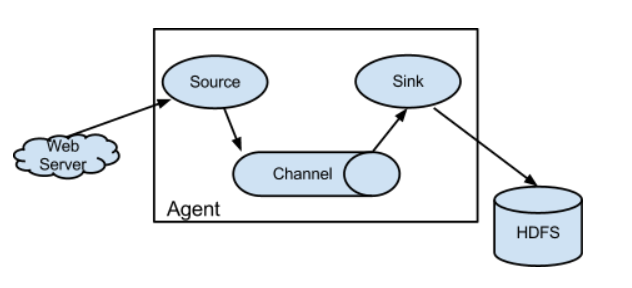
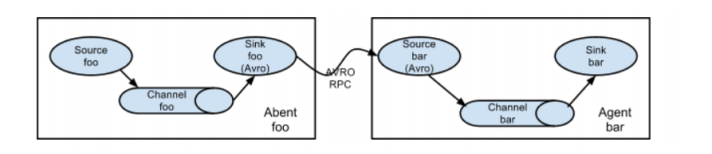
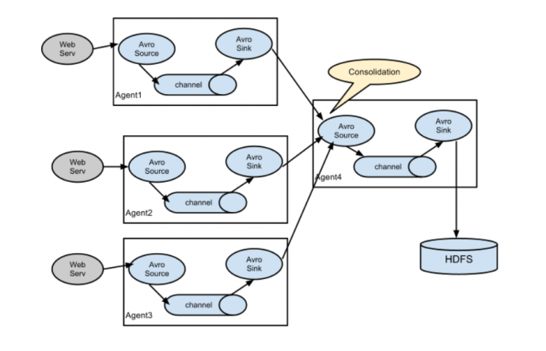
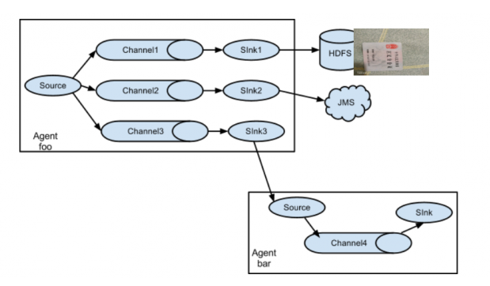

# Flume_基础
## Flume的定义
 `Flume` 是一个分布式的、高可靠的、高可用的将大批量的不同数据源的日志数据收集、聚合、移动到数据中心（`HDFS`）进行存储的系统。即是日志采集和汇总的工具。

## Flume的优势
1. 可以高速采集数据，采集的数据能够以想要的文件格式及压缩方式存储在`HDFS`上。
2. 事务功能保证了数据在采集的过程中数据不丢失。
3. 部分 `Source` 保证了 `Flume` 挂了以后重启依旧能够继续在上一次采集点采集数据，真正做到数据零丢失。

## Flume的组成
1. `Source`(源端数据采集)：`Flume` 提供了各种各样的 `Source` 、同时还提供了自定义的 `Source`。
2. `Channel` (临时存储聚合数据)：主要用的是`Memory Channel`和 `File Channel`（生产最常用），生产中 `Channel` 的数据一定是要监控的，防止` Sink`挂了，撑爆` Channel`。
3. `Sink`（移动数据到目标端）：如`HDFS`、`KAFKA`、`DB`以及自定义的 `Sink`。

## Flume的架构

- 单 `Agent`：

- 串联 `Agent`：

- 并联`Agent`：

- 多 `SinkAgent`：

## Agent配置使用案列
1. `Flume` 的使用其实就是 `Source`、`Channel`、`Sink` 的配置。
2. `Agent=Source+Channel+Sink`，其实 `Agent` 就是 `Flume` 的配置文件。
3. 一个配置文件可以配置多个 `Agent` 的。
4. `Event`：`Flume` 数据传输的最小单位，一个 `Event` 就是一条记录，由 `Head` 和 `Body`两个部分组成，`Head` 存储的是管道，`Body` 存储的是字节数组。

**使用Exec Source采集文件数据到HDFS**

- 缺点：
1. 虽然此种 `Tail`方式可以将日志数据采集到 `HDFS`，但是 `Tail -F`进程挂了咋办，还是会丢数据！生产上是行不通的。无法做到高可用。
2. 其次上面的采集流程并未解决生成大量小文件的问题，无法做到高可靠。
3. `Tail` 只能监控一个文件，生产中更多的是监控一个文件夹。不能满足需求。

**使用Spooling Directory Source采集文件夹数据到 HDFS**

- 写到 `HDFS`上的文件大小最好是100M左右，比`Blocksize` 的值（128M）略低。
- 一般使用 `Rolllnterval`（时间）、`RollSize`（大小）来控制文件的生成，哪个先触发就会生成 `HDFS` 文件，将根据条数的 `Roll`关闭。
- `RollSize` 控制的大小是指的压缩前的，所以若`HDFS`文件使用了压缩，需调大 `Rollsize`的大小。
- 当文件夹下的某个文件被采集到`HDFS`上，会有个 `Complete`的标志。
- 使用`Spooling Directory Source`采集文件数据时若该文件数据已经被采集，再对该文件做修改是会报错的停止的，其次若放进去一个已经完成采集的同名数据文件也是会报错停止的。
- 写 `HDFS`数据可按照时间分区，注意改时间刻度内无数据则不会生成该时间文件夹。
- 生成的文件名称默认是前缀+时间戳，这个是可以更改的。

- 缺点
1. 虽然能监控一个文件夹，但是无法监控递归的文件夹中的数据。
2. 若采集时 `Flume`挂了，无法保证重启时还从之前文件读取的那一行继续采集数据。

**使用Taildir Source采集文件夹数据到HDFS**

- `Taildir Source` 是`Apache flume1.7`新推出的，但是`CDH Flume1.6`做了集成。
- `Taildir Source`是高可靠（`Reliable`）的 `Source`，他会实时的将文件偏移量写到`Json`文件中并保存到磁盘。下次重启`Flume`时会读取`Json`文件获取文件偏移量，然后从之前的位置读取数据，保证数据零丢失。
- `Taildir Source`可同时监控多个文件夹以及文件。即使文件在实时写入数据。
- `Taildir Source`也是无法采集递归文件下的数据，这需要改造源码。
- `Taildir Source`监控一个文件夹下的所有文件一定要用.*正则。