# Hadoop基础

## Hadoop
`Hadoop`主要分为三大模块，分别是 `HDFS`（文件分布系统）， `MapReduce`（分布式计算框架），`YARN`（资源调度管理）。

### HDFS
#### HDFS的组成
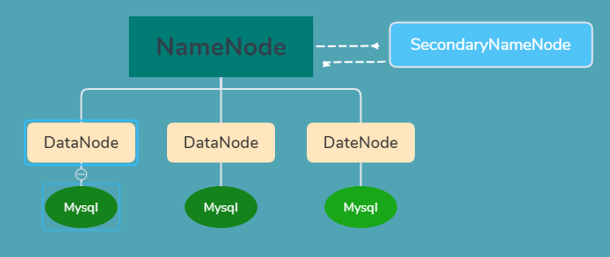

##### NameNode
**主要作用**

* 存储数据

存储对应的元数据，其中元数据包括：目录结构树，文件，数据块和副本的映射关系（不是数据信息，是映射关系）

* 存储位置

内存和磁盘

**包含的文件**

- `fsimage`：元数据镜像文件，存储某一时段`NameNode`内存元数据信息即保存了最新的元数- 据`checkpoint`。

- `edits`：操作日志文件。

- `fstime`：保存最近一次`checkpoint`的时间。

1、`NameNode` 为了保证交互速度，会在内存中保存这些元数据信息，但同时也会将这些信息保存到硬盘上进行持久化存储；

2、`fsimage`文件是内存中的元数据在硬盘上的`checkpoint`，它是一种序列化的格式，不能直接修改。

3、`Hadoop`在重启时就是通过`fsimage+edits`来状态恢复，`fsimage`相当于一个`checkpoint`，首先将最新的`checkpoint`的元数据信息从`fsimage`中加载到内存，然后逐一执行`edits`修改日志文件中的操作以恢复到重启之前的最终状态。

4、`Hadoop`的持久化过程是将上一次`checkpoint`以后最近一段时间的操作保存到修改日志文件`edits`中。

##### SecondaryNameNode
* 主要作用

作为`NameNode`的冷备份；合并`fsimage`（元数据镜像文件（文件系统的目录树））和`fsedits`然后再发给`Namenode`,分担`NameNode`的一部分工作。

1、`edits`：元数据的操作日志（针对文件系统做的修改操作记录）

2、`Namenode`内存中存储的是`fsimage+edits`。

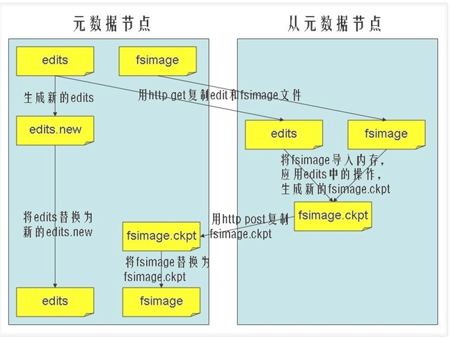

* `SecondaryNameNode`节点 的主要功能是周期性将元数据节点的命名空间镜像文件（`fsimage`）和修改日志（`edits`）进行合并，以防edits日志文件过大。下面来看一看合并的流程：

1、`SecondaryNameNode`节点 需要合并时，首先通知`NameNode`节点生成新的日志文件，以后的日志都写到新的日志文件中。

2、`SecondaryNameNode`节点 用`http get`从`NameNode`节点获得`fsimage`文件及旧的`edits`日志文件。

3、`SecondaryNameNode`节点 将 `fsimage` 文件加载到内存中，并执行日志文件中的操作，然后生成新的`fsimage`文件。

4、`SecondaryNameNode `节点将新的`fsimage`文件用`http post`传回`NameNode`节点上。

5、`NameNode` 节点可以将旧的`fsimage`文件及旧的日志文件，换为新的`fsimage`文件和新的日志文件(第一步生成的)，然后更新`fstime`文件，写入此次`checkpoint`的时间。

6、这样`NameNode` 节点中的`fsimage`文件保存了最新的`checkpoint`的元数据信息，日志文件也重新开始，不会变的很大了。

* 注意：

1、这种机制有个问题：因`edits`存放在`NameNode`中，当`NameNode`挂掉，`edits`也会丢失，导致利用`Secondary NameNode`恢复`Namenode`时，会有部分数据丢失。

2、`HDFS`设置了两种机制进行条件合并（`hdfs-site.xml`）：

第一种：当时间间隔大于或者等于`dfs.namenode.checkpoint.period`配置的时间是做合并（默认一小时）。

第二种：当最后一次往`journalNode`写入的`TxId`（这个可以在`Namenode`日志或者50070界面可以看到）和最近一次做`checkpoint`的`TxId`的差值大于或者等于`dfs.namenode.checkpoint.txns`配置的数量（默认1000000）时做一次合并。

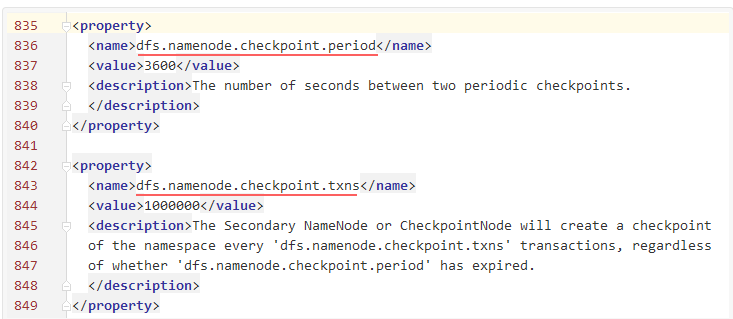

> 引用的博客：[参考资料](https://blog.xiaoxiaomo.com/2016/06/25/Hadoop-HDFS之NameNode/)

##### DataNode
* 主要作用

主要负责存储对应的文件（这里的文件是对应的数据块，`Hadoop2.x`以后默认大小为128M），备份对应的文件（副本数目可在配置里设置`dfs.replication`）。

#### HDFS的优点和缺点
##### HDFS优点
1、可构建在廉价机器上。

2、高容错性。

3、适合批处理。

4、适合大数据处理。

5、流式文件访问。

##### HDFS缺点
1、低延迟数据访问。

2、小文件存取。

3、并发写入、文件随机修改。

**`HDFS`文件系统为什么不适用于存储小文件? **

这和`HDFS`系统底层设计实现有关系的，`HDFS`本身的设计就是用来解决海量大文件数据的存储。当数据被`HDFS`存储的时候，它会被切割成多个的独立的数据块，而这些数据块的信息会被存储在元数据中。如果文件越小，对应的元数据里内存空间就会被占用，从而造成性能上的浪费。

**如何解决？**

* 1、采用`HAR`的归档方式。

`HAR`为构建在其它文件系统上用于文件存档的文件系统，通常将hdfs中的多个文件打包成一个存档文件，减少`Namenode`内存的使用，可以直接使用`hadoop archive`命令创建`HAR`文件。创建`HAR`的过程是在运行一个`mr`作业。

`HAR`在对小文件进行存档后，原文件不会被删除，且创建之后不能改变，文件名中也不能有空格存在，否则会报异常

* 2、采用`CombineFileInputFormat`。

`CombineFileInputFormat`是一种新的`inputformat`，用于将多个文件合成一个单独的split，而且它还可以考虑数据的存储位置。

* 3、开启`JVM`重用。

`JVM`重用可以使得`JVM`实例在同一个`job`中重新使用N次，N的值可以在`hadoop的mapred-site.xml`文件中进行配置，通常在10-20之间。如果没有小文件，不要开启`JVM`重用，因为会一直占用使用到的`task`卡槽，直到任务完成才释放。

#### HDFS的其它功能
##### 心跳机制和重新复制

每个` DataNode` 定期向 `NameNode` 发送心跳消息，（`DataNode`向`NameNode`汇报的信息有2点，一个是自身`DataNode`的状态信息，另一个是自身`DataNode`所持有的所有的数据块的信息。）如果超过指定时间没有收到心跳消息，则将` DataNode` 标记为死亡。`NameNode` 不会将任何新的` IO` 请求转发给标记为死亡的` DataNode`，也不会再使用这些 `DataNode` 上的数据。 由于数据不再可用，可能会导致某些块的复制因子小于其指定值，`NameNode` 会跟踪这些块，并在必要的时候进行重新复制。

##### 副本放置策略
第一副本：放置在上传文件的`DataNode`上；如果是集群外提交，则随机挑选一台磁盘不太慢、`CPU`不太忙的节点上；

第二副本：放置在于第一个副本不同的机架的节点上；

第三副本：与第二个副本相同机架的不同节点上；

如果还有更多的副本：随机放在节点中；

#### HDFS的读写流程
##### HDFS的写操作
> 说明：以下内容引入：[Hadoop-HDFS之读写流程](https://blog.xiaoxiaomo.com/2016/06/26/Hadoop-HDFS之读写流程/)

**准备工作**

1、`HDFS client`先会去询问`NameNode`，看哪些`DataNode`可以存储文件。文件的拆分是在`HDFS client`中完成的，比如拆分成`A`、`B`、`C`。

2、`NameNode`查看它的元数据信息，发现`DataNode 1`，`2`，`7`上有空间可以存储`Block A`，于是将此信息告诉`HDFS Client`。

3、`HDFS Client`接到`NameNode`返回的`DataNode`列表信息后，它会直接联系第一个`DataNode1`，让它准备好接收`Block A`（建立TCP连接）。

4、在`DataNode1`建立好`TCP`连接后它会把`HDFS Client`要写`Block A`的请求顺序传给`DataNode2`(在与`HDFS Client`建立好`TCP`连接后从`HDFS Client`获得的`DataNodel1`信息)，同理传递给`DataNode7`。

5、当`DataNode7`准备好后，会回传信息过来，`HDFS Client`接到信息后表示都准备好了，就可以写数据了。

**写入数据**
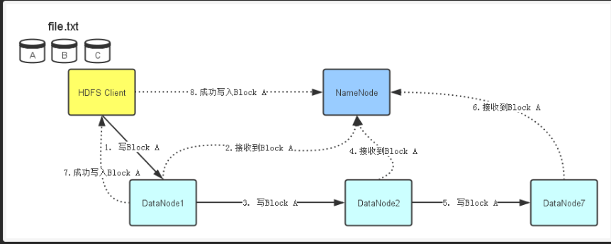

1、`HDFS Client`开始往`DataNode1`写入`Block A`数据。同准备工作一样，当`DataNode1`接收完`Block A`数据后，它会顺序将`Block A`数据传输给`ataNode2`，然后`DataNode2`再传输给`DataNode7`。

2、每个`DataNode`在接收完`Block A`数据后，会发消息给`NameNode`，告诉它`Block`数据已经接收完毕。

3、`NameNode`同时会根据它接收到的消息更新它保存的文件系统元数据信息。

4、当`Block A `成功写入3个`DataNode`之后，`DataNode1`会发送一个成功信息给`HDFS Client`，同时`HDFS Client`也会发一个`Block A`成功写入的信息给`NameNode`。之后，`HDFS Client`才能开始继续处理下一个`Block-Block B`。

##### HDFS读数据操作

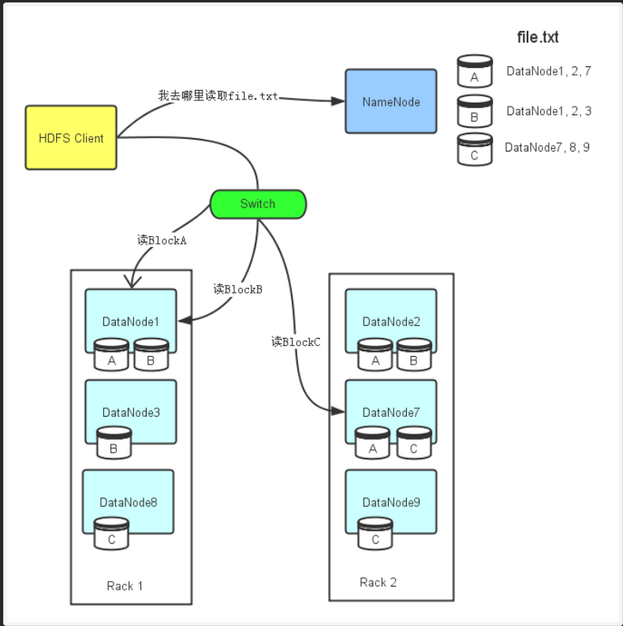

1、`HDFS Client`会先去联系`NameNode`，询问file.txt总共分为几个`Block`而且这些`Block`分别存放在哪些`DataNode`上。

2、由于每个`Block`都会存在几个副本，所以`NameNode`会把`file.txt`文件组成的`Block`所对应的所有`DataNode`列表都返回给`HDFS Client`。

3、然后`HDFS Client`会选择`DataNode`列表里的第一个`DataNode`去读取对应的`Block`。比如由于`Block A`存储在`DataNode1`，`2`，`7`，那么`HDFS Client`会到`DataNode1`去读取`Block A`；`Block C`存储在`DataNode7`，`8`，`9`，那么`HDFS Client`就回到`DataNode7`去读取`Block C`。

**补充**
#### 漫画详解HDFS的存储原理
> 说明：以下图片引用自博客：[翻译经典 HDFS 原理讲解漫画](https://blog.csdn.net/hudiefenmu/article/details/37655491)

##### HDFS写数据原理
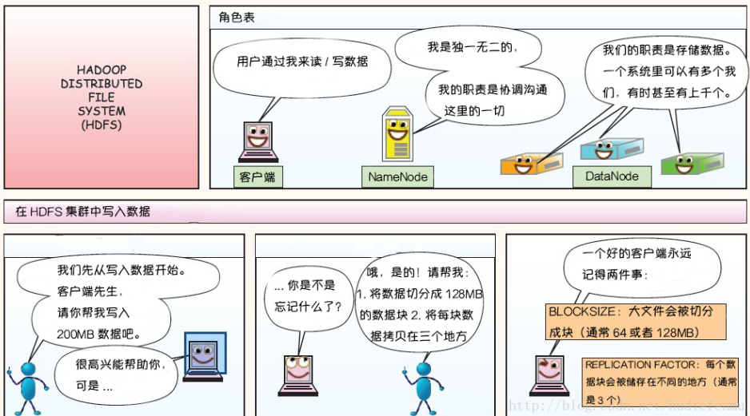
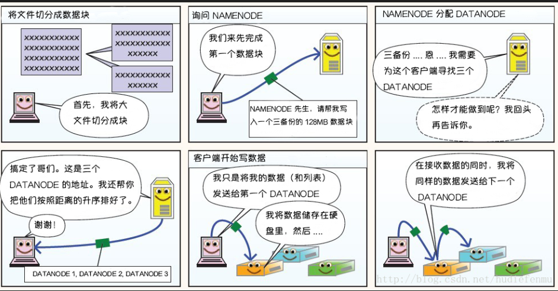
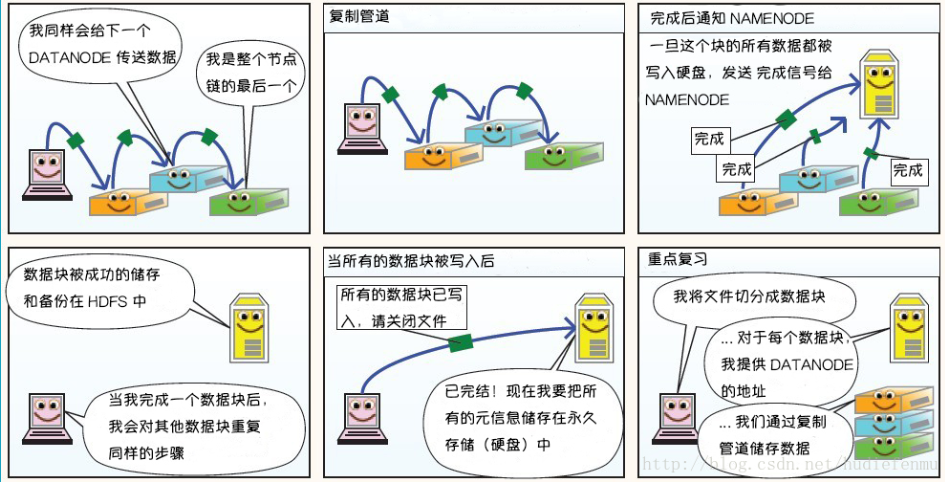

##### HDFS读数据原理
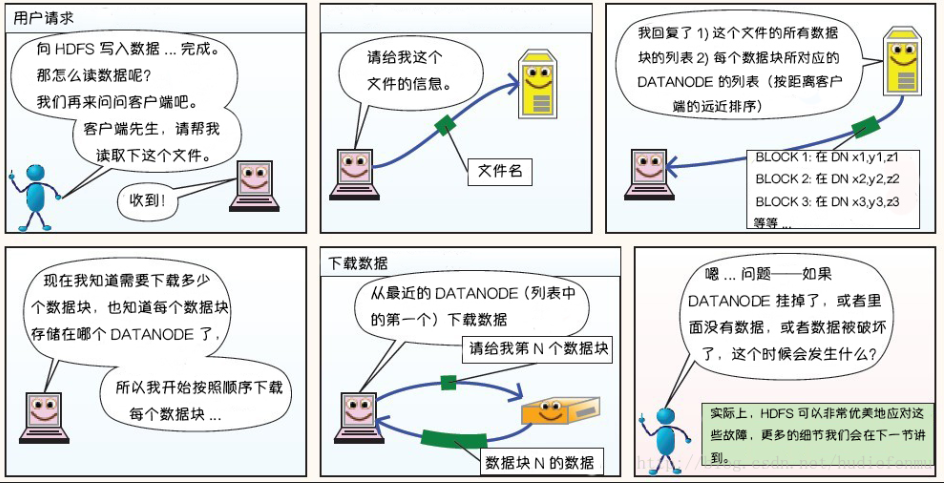

##### HDFS故障类型和其检测方法
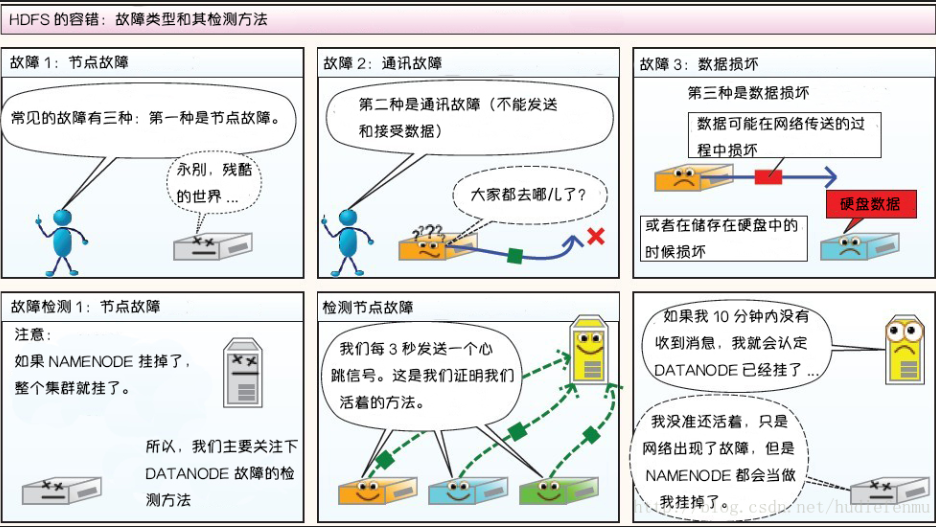
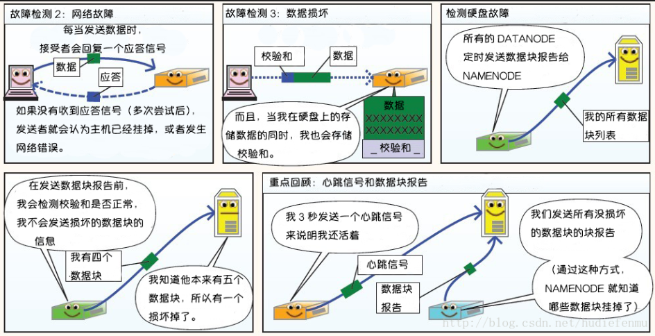

###### 读写故障的处理
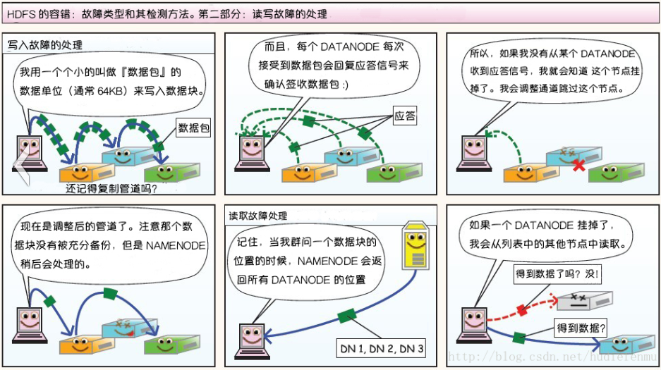

###### DataNode 故障处理
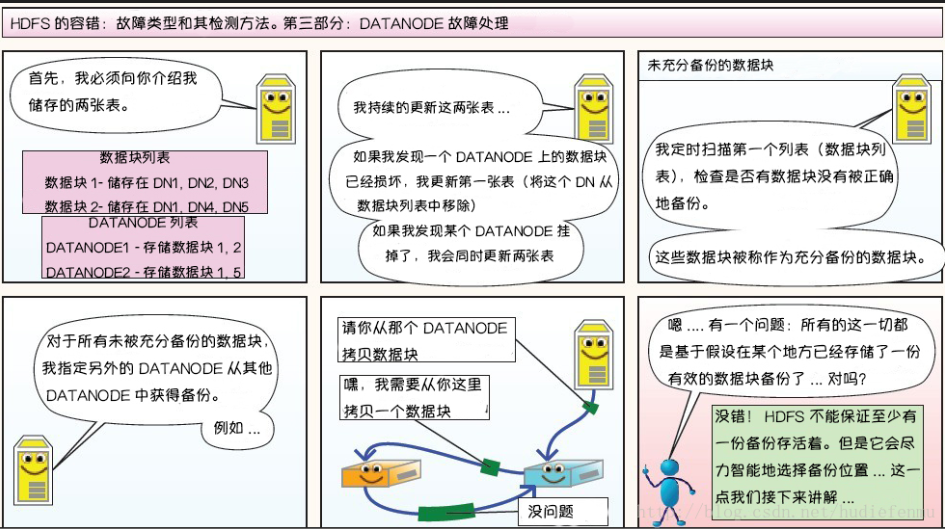

###### 副本布局策略
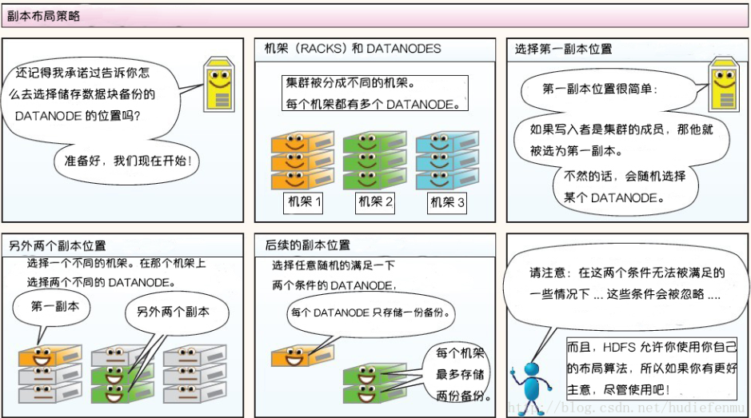
