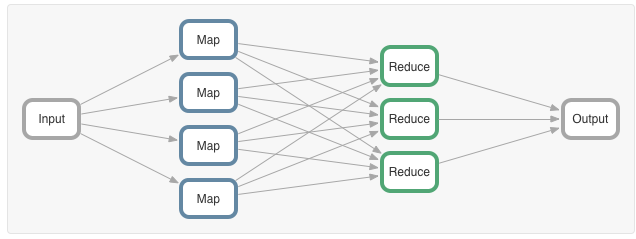
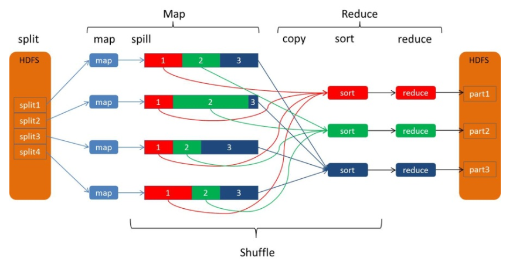
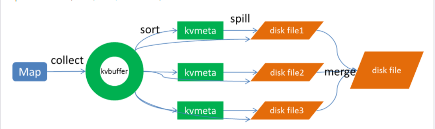

# Hadoop_MapReduce
## 理解MapReduce
* `Mapping`: 对集合里的每个目标应用同一个操作。
* `Reducing`：遍历集合中的元素来返回一个综合的结果。
* 计算框架

* 计算模型

在运行一个`MapReduce`计算任务时候，任务过程被分为两个阶段：`Map`阶段和`Reduce`阶段，每个阶段都是用键值对（`key/value`）作为输入（`Input`）和输出（`Output`）。而程序员要做的就是定义好这两个阶段的函数：`Map`函数和`Reduce`函数。

## MapReduce运行机制
### 角色职责

**1：程序运行时过程设计到的一个角色实体**

1.1. `Client`：编写`mapreduce`程序，配置作业，提交作业的客户端 ；

1.2. `ResourceManager`：集群中的资源分配管理 ；

1.3. `NodeManager`：启动和监管各自节点上的计算资源 ；

1.4. `ApplicationMaster`：每个程序对应一个`AM`，负责程序的任务调度，本身也是运行在`NM`的`Container`中 ；

1.5.`HDFS`：分布式文件系统，保存作业的数据、配置信息等等。

**2：客户端提交Job**

2.1. 客户端编写好`Job`后，调用`Job`实例的`Submit()`或者`waitForCompletion()`方法提交作业；

2.2. 客户端向`ResourceManager`请求分配一个`Application ID`，客户端会对程序的输出、输入路径进行检查，如果没有问题，进行作业输入分片的计算。

**3：Job提交到ResourceManager**

3.1. 将作业运行所需要的资源拷贝到`HDFS`中（jar包、配置文件和计算出来的输入分片信息等）；

3.2. 调用`ResourceManager`的`submitApplication`方法将作业提交到`ResourceManager`。

**4：给作业分配ApplicationMaster**

4.1. `ResourceManager`收到`submitApplication`方法的调用之后会命令一个`NodeManager`启动一个`Container` ；

4.2. 在该`NodeManager`的`Container`上启动管理该作业的`ApplicationMaster`进程。

**5：ApplicationMaster初始化作业**

5.1. `ApplicationMaste`对作业进行初始化操作；

5.2. `ApplicationMaster`从`HDFS`中获得输入分片信息(`map`、`reduce`任务数)

**6：任务分配**

6.1. `ApplicationMaster`为其每个`map`和`reduce`任务向`RM`请求计算资源；
6.2. `map`任务优先于`reduce`任，`map`数据优先考虑本地化的数据。

**7：任务执行**

7.1. 在` Container` 上启动任务（通过`YarnChild`进程来运行），执行`map/reduce`任务。

### MapReduce 执行过程
**1：输入分片（Input Split）**
(一个`Input Split` 对应一个`Map`)

1.1. 一个大的文件会根据`Block`块切分成多个分片，每个输入分片会让一个`Map`任务来处理（默认情况下，`HDFS`的块为128M作为一个分片）。

1.2. 例如一个300MB的文件就会被切分问3个分片（`128MB InputSplit`、`128MB InputSplit`、`44MB InputSplit`），交给三个`Map`任务去处理。

**2：Map任务阶段：由我们自己编写，最后调用 context.write(…)；**
(一个`Map` 对应一个内存缓存区)

2.1. `Map`输出的结果会暂且放在一个环形内存缓冲区中（默认`mapreduce.task.io.sort.mb=100M`）,当该缓冲区快要溢出时（默认`mapreduce.map.sort.spill.percent=0.8`）,会在本地文件系统中创建一个溢出文件，将该缓冲区中的数据写入这个文件；

**3：Partition分区阶段**
(一个`Partition`分区对应一个`Reduce`任务)

3.1. 在`Map`中调用 `context.write(k2,v2)`方法输出`<k2,v2>`，该方法会立刻调用`Partitioner`类对数据进行分区，一个分区对应一个 `Reduce Task`。

3.2. 默认的分区实现类是 `HashPartitioner` ，根据k2的哈希值` % numReduceTasks`，可能出现“数据倾斜”现象。

3.3. 可以自定义` Partition` ，调用` job.setPartitioner(…)`自己定义分区函数。

**4：Combiner合并阶段：将属于同一个Reduce处理的输出结果进行合并操作**

4.1. 是可选的；

4.2. 目的有三个：1.减少`Key-Value`对；2.减少网络传输；3.减少`Reduce`的处理。

**5：`Shuffle`阶段：即`Map和Reduce`中间的这个过程**

5.1. 首先`Map`在做输出时候会在内存里开启一个环形内存缓冲区，专门用来做输出，同时`Map`还会启动一个守护线程；

5.2. 如缓冲区的内存达到了阈值的80%，守护线程就会把内容写到磁盘上，这个过程叫`Spill`，另外的20%内存可以继续写入要写进磁盘的数据；

5.3. 写入磁盘和写入内存操作是互不干扰的，如果缓存区被撑满了，那么`Map`就会阻塞写入内存的操作，让写入磁盘操作完成后再继续执行写入内存操作;

5.4. 写入磁盘时会有个排序操作，如果定义了`Combiner`函数，那么排序前还会执行`Combiner`操作；

5.5. 每次`Spill`操作也就是写入磁盘操作时候就会写一个溢出文件，也就是说在做`Map`输出有几次`Spill`就会产生多少个溢出文件，等`Map`输出全部做完后，`Map`会合并这些输出文件，这个过程里还会有一个`Partitioner`操作（如上）

5.6. 最后 `Reduce` 就是合并`Map`输出文件，`Partitioner`会找到对应的`Map`输出文件，然后进行复制操作，复制操作时`Reduce`会开启几个复制线程，这些线程默认个数是5个（可修改），这个复制过程和`Map`写入磁盘过程类似，也有阈值和内存大小，阈值一样可以在配置文件里配置，而内存大小是直接使用`Reduce`的`Tasktracker`的内存大小，复制时候`Reduce`还会进行排序操作和合并文件操作，这些操作完了就会进行`Reduce`计算了。

**6：Reduce阶段：**
由我们自己编写，最终结果存储在hdfs上的,一个`Reduce`对应一个输出文件。

* 整个过程

* Spill 过程

> 参考内容：[Hadoop--MapReduce详解](https://blog.xiaoxiaomo.com/2016/07/03/Hadoop-MapReduce详解/)