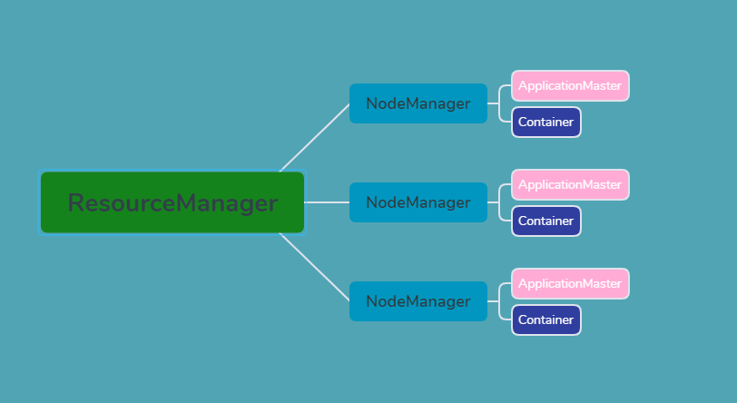
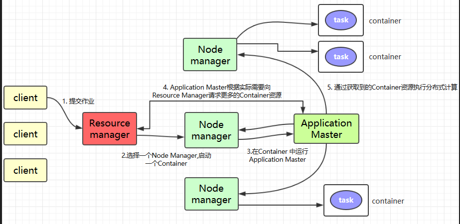

# Hadoop_YARN
## YARN主要架构

### ResourceManager
集群资源的协调者和管理者，负责给用户提交的所有程序分配资源。

### NodeManager
集群具体资源的管理者，负责节点内所有容器的生命周期的管理，资源监控。

**具体：**

- 启动时向 `ResourceManager` 注册并定时发送心跳消息，等待 `ResourceManager` 的指令；

- 维护 `Container` 的生命周期，监控 `Container` 的资源使用情况；

- 管理任务运行时的相关依赖，根据 `ApplicationMaster` 的需要，在启动 `Container` 之前将需要的程序及其依赖拷贝到本地。

### ApplicationMaster
负责协调来自`ResourceManager`的资源，并通过 `NodeManager` 监视容器内资源的使用情况，同时还负责任务的监控与容错。

**具体：**

- 根据应用的运行状态来决定动态计算资源需求；

- 向 `ResourceManager` 申请资源，监控申请的资源的使用情况；

- 跟踪任务状态和进度，报告资源的使用情况和应用的进度信息；

- 负责任务的容错。

### Container
`YARN`资源的抽象，`YARN` 会为每个任务分配一个 `Container`，该任务只能使用该 `Container` 中描述的资源。`ApplicationMaster` 可在 `Container` 内运行任何类型的任务。

### YARN工作原理图
> 说明：一下内容引入：[BigData-Notes](https://github.com/heibaiying/BigData-Notes)

1. `Client` 提交作业到 YARN 上；

2. `Resource Manager` 选择一个 `Node Manager`，启动一个 `Container` 并运行 `Application Master` 实例；

3. `Application Master` 根据实际需要向 `Resource Manager` 请求更多的 `Container` 资源（如果作业很小, 应用管理器会选择在其自己的 JVM 中运行任务）；

4. `Application Master` 通过获取到的 `Container` 资源执行分布式计算。

