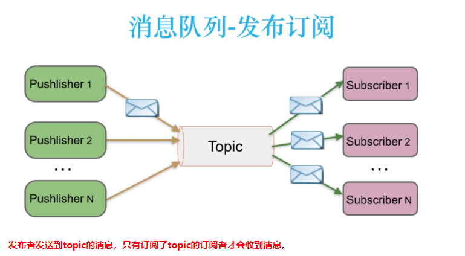
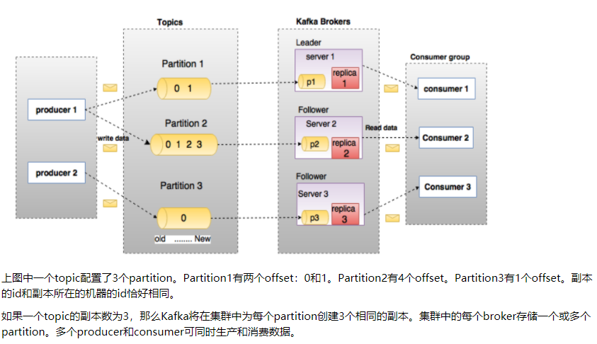

# Kafka基础

## Kafka的定义
一个分布式、分区的、多副本的、多订阅者，基于 `Zookeeper` 协调的分布式日志系统。采用发布-订阅模式。

## Kafka的优点

- 解耦。
- 冗余（副本）。
- 扩展性。
- 灵活性&峰值处理能力。
- 可恢复性。
- 顺序保证。
- 缓冲。
- 异步通信。

## Kafka中的术语

- 整体

- Broker
`Kafka` 集群包含一个或多个服务器，服务器节点称为 `Broker`。

`Broker` 存储 `Topic` 的数据。如果某 `Topic` 有 `N` 个 `Partition`，集群有 `N` 个 `Broker`，那么每个 `Broker` 存储该 `Topic`的一个 `Partition`。

如果某 `Topic` 有 `N` 个 `Partition`，集群有(`N+M`)个 `Broker` ，那么其中有 `N` 个 `Broker` 存储该 `Topic` 的一个 `Partition` ，剩下的 `M` 个 `Broker` 不存储该 `Topic` 的 `Partition`数据。

如果某 `Topic` 有 `N` 个 `Partition` ，集群中 `Broker`数目少于 `N`个，那么一个 `Broker` 存储该 `Topic` 的一个或多个 `Partition`。在实际生产环境中，尽量避免这种情况的发生，这种情况容易导致 `Kafka`集群数据不均衡。

- Topic

每条发布到 `Kafka`集群的消息都有一个类别，这个类别被称为 `Topic`。

- Partition

`Topic` 中的数据分割为一个或多个 `Partition`。每个 `Topic` 至少有一个 `Partition`。每个 `Partition` 中的数据使用多个 `Segment` 文件存储。`Partition` 中的数据是有序的，不同 `Partition`间的数据丢失了数据的顺序。如果 `Topic` 有多个 `Partition`，消费数据时就不能保证数据的顺序。在需要严格保证消息的消费顺序的场景下，需要将 `Partition`数目设为1。

- Producer

生产者即数据的发布者，该角色将消息发布到 `Kafka` 的 `Topic`中。`Broker` 接收到生产者发送的消息后，`Broker` 将该消息追加到当前用于追加数据的 `Segment`文件中。生产者发送的消息，存储到一个`Partition` 中，生产者也可以指定数据存储的 `Partition`。

- Consumer

消费者可以从 `Broker`中读取数据。消费者可以消费多个`Topic` 中的数据。

- Consumer Group

每个 `Consumer` 属于一个特定的 `Consumer Group`（可为每个 `Consumer` 指定 `Group Name`，若不指定 `Group Name`则属于默认的 `Group`）。

- Leader

每个 `Partition`有多个副本，其中有且仅有一个作为 `Leader`，`Leader`是当前负责数据的读写的 `Partition`。

- Follower

`Follower`跟随 `Leader`，所有写请求都通过 `Leader`路由，数据变更会广播给所有 `Follower`，`Follower` 与 `Leader` 保持数据同步。如果 `Leader`失效，则从 `Follower` 中选举出一个新的 `Leader`。当 `Follower` 与 `Leader` 挂掉、卡住或者同步太慢，`Leader`会把这个 `Follower` 从“in sync replicas”（ISR）列表中删除，重新创建一个 `Follower`。