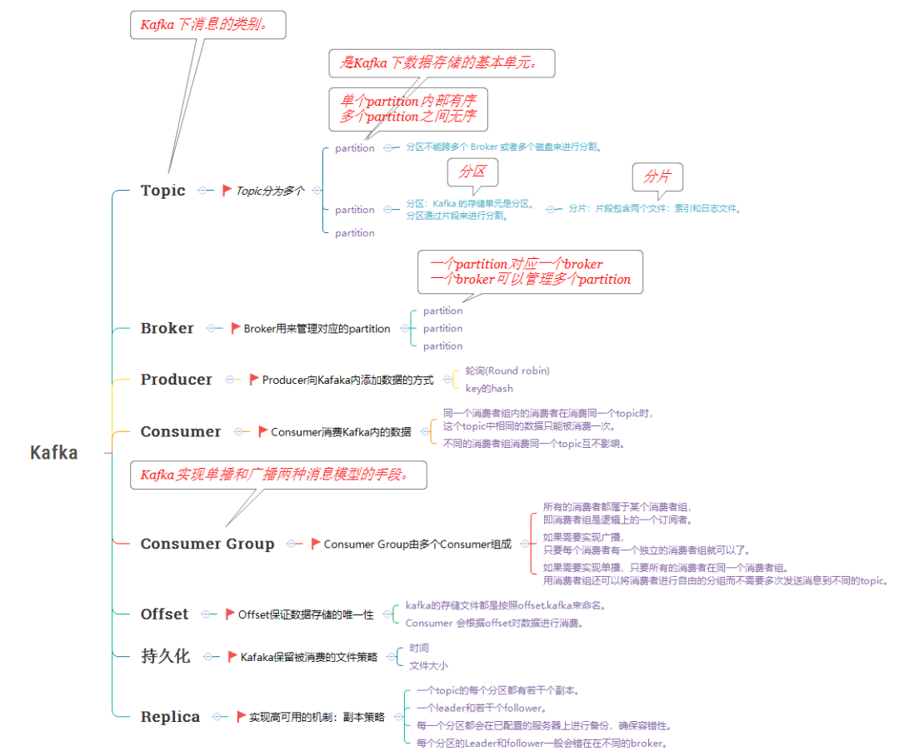
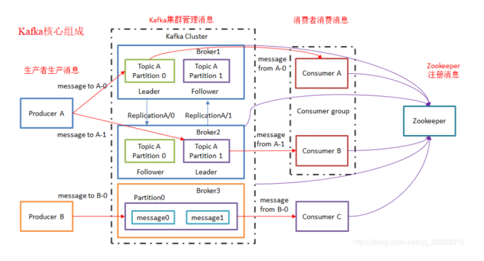
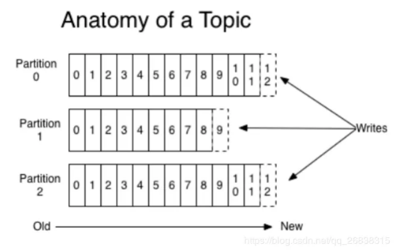
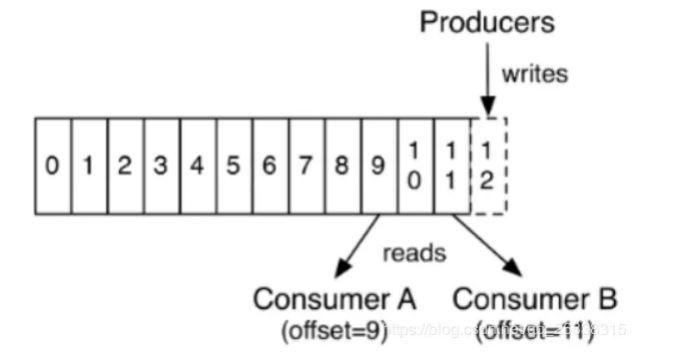

# Kafka_架构

- `Topic` 可以类比为数据库中的库。
- `Partition` 可以类比为数据库中的表。
- 一个 `Topic` 就是一个消息队列，然后它把每个 `Topic` 又分为很多个 `Partition` 。
- 一个 `Topic` 可以有多个消费者组。
- 同一个消费者组内的消费者在消费同一个 `Topic` 时，这个 `Topic` 中相同的数据只能被消费一次，即每个 `Partion` 只会把消息发给该消费者组中的一个消费者。
- 不同的消费者组消费同一个 `Topic` 互不影响。
- 一台Kafka服务器节点就是一个 `Broker` 。一个集群由多个 `Broker` 组成。一个 `Broker` 可以容纳多个 `Topic` 。

### Topic
`Topic` 就是数据主题，`Kafka` 建议根据业务系统将不同的数据存放在不同的 `Topic` 中。

- `Kafka` 中的 `Topics`总是多订阅者模式，一个 `Topic` 可以拥有一个或者多个消费者来订阅它的数据。
- 一个大的`Topic` 可以分布式存储在多个 `Kafka Broker` 中。
- `Topic` 可以类比为数据库中的库。
- 一个 `Topic`就是一个消息队列，然后它把每个 `Topic` 又分为很多个 `Partition`。
- 在每个 `Partition` 内部消息强有序，相当于有序的队列，其中每个消息都有个序号 `Offset` ，比如 0 到 12，从前面读往后面写。

### Partition
- 一个 `Topic` 可以分为多个 `Partition` ，通过分区的设计，`Topic` 可以不断进行扩展。一个 `Topic` 的多个分区分布式存储在多个 `Broker` (服务器)上。此外通过分区还可以让一个 `Topic` 被多个 `Consumer` 进行消费。以达到并行处理。分区可以类比为数据库中的表。
- `Partition` 内部有序，但一个 `Topic` 的整体（多个` Partition` 间）不一定有序 `Kafka` 只保证按一个 `Partition` 中的顺序将消息发给 `Consumer` ，`Partition中`的每条消息都会被分配一个有序的 `Id（Offset）`，每个 `Partition` 内部消息是一个强有序的队列，但不保证一个 `Topic` 的整体（多个 `Partition` 间）的顺序。
- 一个 `Partition` 对应一个 `Broker` ，一个 `Broker` 可以管理多个 `Partition`。
- `Partition` 可以很简单想象为一个文件，`Partition` 对应磁盘上的目录，当数据发过来的时候它就往这个 `Partition` 上面追加，消息不经过内存缓冲，直接写入文件。

`Kafka` 为每个主题维护了分布式的分区(`Partition`)日志文件，每个 `Partition` 在 `Kafka` 存储层面是 `Append Log` 。任何发布到此partition的消息都会被追加到 `Log` 文件的尾部，在分区中的每条消息都会按照时间顺序分配到一个单调递增的顺序编号，也就是我们的 `Offset` 。` Offset` 是一个 `long` 型的数字，我们通过这个 `Offset` 可以确定一条在该 `Partition` 下的唯一消息。在 `Partition`下面是保证了有序性，但是在 `Topic` 下面没有保证有序性。

- 每个 `Partition` 都会有副本，可以在创建 `Topic` 时来指定有几个副本。

### Offset
 - `Kafka` 的存储文件都是按照 `Offset` 。`Kafka` 来命名，用 `Offset` 做名字的好处是方便查找。
- 数据会按照时间顺序被不断第追加到分区的一个结构化的 `Commit Log` 中！每个分区中存储的记录都是有序的，且顺序不可变！
- 这个顺序是通过一个称之为 `Offset` 的 `Id` 来唯一标识！因此也可以认为 `Offset` 是有序且不可变的！
- 在每一个消费者端，会唯一保存的元数据是 `Offset`（偏移量）,即消费在 `Log`中的位置，偏移量由消费者所控制。通常在读取记录后，消费者会以线性的方式增加偏移量，但是实际上，由于这个位置由消费者控制，所以消费者可以采用任何顺序来消费记录。例如，一个消费者可以重置到一个旧的偏移量，从而重新处理过去的数据；也可以跳过最近的记录，从"现在"开始消费。

**Topic拓扑结构**

**数据流**

### Producer
消息生产者，就是向 `Kafka Broker` 发消息的客户端。将记录分配到 `Topic` 的指定 `Partition`（分区）中。

**两种发送的机制：**

- 轮询(`Round Robin`)

先随机到某一个`Partition` 上一直持续的写，大概写个十分钟，再随机到一个 `Partition` 再去写，所以一般建议生产消息都按照建个 `Key`来按照 `Hash` 去分，还可以自定义按照 `Key`怎么去分。

- `Key` 的 `Hash`

如果 `Key` 为 `NULL`，就是轮询，否则就是按照 `Key` 的 `Hash`。

### Consumer
消息消费者，向 `Kafka Broker`取消息的客户端。

- 每个 `Consumer` 都有自己的消费者组 `Group`。
- 同一个消费者组内的消费者在消费同一个 `Topic` 时，这个 `Topic` 中相同的数据只能被消费一次。
- 不同的消费者组消费同一个 `Topic` 互不影响。
- 低版本0.9之前将 `Offset` 保存在 `Zookeeper` 中，0.9及之后保存在 `Kafka` 的“` __consumer_offsets` ”主题中。

### Consumer Group
每个消费者都会使用一个消费组名称来进行标识。同一个组中的不同的消费者实例，可以分布在多个进程或多个机器上。

- 一个 `Topic` 可以有多个消费者组。`Topic` 的消息会复制（不是真的复制，是概念上的）到所有的 `CG` ，但每个 `Partion` 只会把消息发给该 `CG` 中的一个 `Consumer` 。
- 消费者组内每个消费者负责消费不同分区的数据，一个分区只能由一个消费者消费；
- 消费者组之间互不影响。
- 所有的消费者都属于某个消费者组，即消费者组是逻辑上的一个订阅者。
- 如果所有的消费者实例在同一消费组中，消息记录会负载平衡到每一个消费者
- 实例（单播）。即每个消费者可以同时读取一个 `Topic` 的不同分区！

消费者组是 `Kafka` 用来**实现一个 `Topic` 消息的广播（发给所有的消费者）和单播（发给任意一个消费者）**的手段。

- 如果需要实现广播，只要每个消费者有一个独立的消费者组就可以了。
- 如果需要实现单播，只要所有的消费者在同一个消费者组。用消费者组还可以将消费者进行自由的分组而不需要多次发送消息到不同的 `Topic` 。

### Broker
`Kafka` 集群的 `Server`，一台 `Kafka`服务器节点就是一个 `Broker` ，负责处理消息读、写请求，存储消息，在 `Kafka Cluster` 这一层这里，其实里面是有很多个 `Broker` 。

- 一个集群由多个 `Broker` 组成。一个 `Broker` 可以容纳多个 `Topic` 。
- `Broker` 是组成 `Kafka` 集群的节点， `Broker` 之间没有主从关系，各个 `Broker` 之间的协调依赖于。
- `Zookeeper`，如数据在哪个节点上之类的。
- `Kafka` 集群中有一个 `Broker` 会被选举为 `Controller` ，负责管理集群 `Broker` 的上下线，所有 `Topic` 的分区副本分配和 `Leader` 选举等工作。
- `Controller` 的管理工作都是依赖于 `Zookeeper` 的。

### Replica副本机制
副本，为保证集群中的某个节点发生故障时，该节点上的 `Partition` 数据不丢失，且 `Kafka` 仍然能够继续工作， `Kafka` 提供了副本机制，一个 `Topic` 的每个分区都有若干个副本，一个 `Leader` 和若干个 `Follower`。

- 日志的分区`Partition `（分布）在 `Kafka` 集群的服务器上。每个服务器在处理数据和请求时，共享这些分区。每一个分区都会在已配置的服务器上进行备份，确保容错性。
- 每个分区都有一台 `Server` 作为 “ `Leader` ”，零台或者多台 `Server` 作为 `Follwers` 。`Leader Server` 处理一切对 `Partition` （分区）的读写请求，而 `Follwers` 只需被动的同步 `Leader` 上的数据。当 `Leader` 宕机了，`Followers `中的一台服务器会自动成为新的 `Leader`。通过这种机制，既可以保证数据有多个副本，也实现了一个高可用的机制！
- 同一个 `Partition` 可能会有多个 `Replication`（对应 `server.properties` 配置中的 `default.replication.factor=N`）。没有 `Replication`的情况下，一旦 `Broker` 宕机，其上所有`Partition` 的数据都不可被消费，同时 `Producer` 也不能再将数据存于其上的 `Patition` 。引入 `Replication` 之后，同一个 `Partition` 可能会有多个 `Replication` ，而这时需要在这些 `Replication` 之间选出一个 `Leader`，`Producer` 和 `Consumer` 只与这个 `Leader` 交互，其它 `Replication` 作为 `Follower` 从 `Leader` 中复制数据。
- 基于安全考虑，每个分区的 `Leader` 和 `Follower` 一般会错在在不同的 `Broker` !

