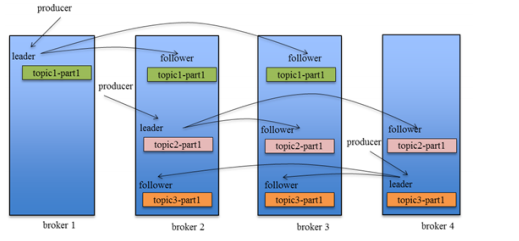

# Kafka_高可用
为了更好的做负载均衡，`Kafka` 尽量将所有的 `Partition` 均匀分配到整个集群上。一个典型的部署方式是一个 `Topic` 的 `Partition` 数量大于 `Broker` 的数量。同时为了提高 `Kafka` 的容错能力，也需要将同一个 `Partition` 的 `Replica` 尽量分散到不同的机器。实际上，如果所有的 `Replica` 都在同一个 `Broker` 上，那一旦该 `Broker` 宕机，该 `Partition` 的所有 `Replica` 都无法工作，也就达不到 `HA` 的效果。同时，如果某个 `Broker` 宕机了，需要保证它上面的负载可以被均匀的分配到其它幸存的所有 `Broker` 上。

**Kafka分配Replica的算法如下：**

1. 将所有 `Broker`（假设共 `n` 个 `Broker` ）和待分配的 `Partition` 排序。
2. 将第 `i` 个 `Partition` 分配到第`（i mod n ）`个 `Broker` 上。
3. 将第 `i` 个 `Partition` 的第 `j` 个 `Replica` 分配到第`（(i + j) mode n）`个 `Broker` 上。

 `Producer`在发布消息到某个 `Partition` 时，先通过 `ZooKeeper` 找到该 `Partition` 的 `Leader` ，然后无论该 `Topic` 的 `ReplicationFactor` 为多少，`Producer` 只将该消息发送到该 `Partition` 的 `Leader` 。`Leader` 会将该消息写入其本地 `Log`。每个 `Follower` 都从 `Leader Pull` 数据。这种方式上，`Follower` 存储的数据顺序与 `Leader` 保持一致。`Follower` 在收到该消息并写入其 `Log` 后，向 `Leader` 发送 `ACK`。一旦 `Leader` 收到了 `ISR` 中的所有 `Replica` 的`ACK` ，该消息就被认为已经 `Commit`了，`Leader` 将增加 `HW` 并且向 `Producer` 发送 `ACK`。

为了提高性能，每个 `Follower` 在接收到数据后就立马向 `Leader` 发送 `ACK`，而非等到数据写入 `Log` 中。因此，对于已经 `Commit`的消息，`Kafka` 只能保证它被存于多个 `Replica` 的内存中，而不能保证它们被持久化到磁盘中，也就不能完全保证异常发生后该条消息一定能被 `Consumer` 消费。

`Consumer` 读消息也是从 `Leader` 读取，只有被 `Commit` 过的消息才会暴露给 `Consumer`。

**对于Kafka而言，定义一个Broker是否“活着”包含两个条件：**

- 1是它必须维护与 `ZooKeeper` 的 `Session`（这个通过 `ZooKeeper` 的 `Heartbeat` 机制来实现）。
- 2是 `Follower` 必须能够及时将 `Leader` 的消息复制过来，不能“落后太多”。

`Leader`会跟踪与其保持同步的 `Replica` 列表，该列表称为 `ISR`（即 `In-Sync Replica` ）。如果一个 `Follower` 宕机，或者落后太多，`Leader` 将把它从 `ISR` 中移除。这里所描述的“落后太多”指 `Follower` 复制的消息落后于 `Leader` 后的条数超过预定值（该值可在` $KAFKA_HOME/config/server.properties` 中通过 `replica.lag.max.messages` 配置，其默认值是 `4000`）或者 `Follower` 超过一定时间（该值可在 `$KAFKA_HOME/config/server.properties` 中通过`replica.lag.time.max.ms` 来配置，其默认值是`10000` ）未向`Leader` 发 `Fetch`请求。

`Kafka` 的复制机制既不是完全的同步复制，也不是单纯的异步复制。事实上，完全同步复制要求所有能工作的 `Follower` 都复制完，这条消息才会被认为 `Commit`，这种复制方式极大的影响了吞吐率（高吞吐率是 `Kafka` 非常重要的一个特性）。而异步复制方式下，`Follower` 异步的从 `Leader` 复制数据，数据只要被 `Leader` 写入 `Log`就被认为已经 `Commit`，这种情况下如果 `Follower` 都复制完都落后于 `Leader`，而如果 `Leader` 突然宕机，则会丢失数据。而 `Kafka` 的这种使用 `ISR` 的方式则很好的均衡了确保数据不丢失以及吞吐率 `Follower` 可以批量的从 `Leader` 复制数据，这样极大的提高复制性能（批量写磁盘），极大减少了 `Follower` 与 `Leader` 的差距。

需要说明的是，`Kafka` 只解决 `Fail/Recover`，不处理“` Byzantine` ”（“拜占庭”）问题。一条消息只有被 `ISR` 里的所有 `Follower` 都从 `Leader` 复制过去才会被认为已提交。这样就避免了部分数据被写进了 `Leader`，还没来得及被任何`Follower` 复制就宕机了，而造成数据丢失（ `Consumer` 无法消费这些数据）。而对于`Producer` 而言，它可以选择是否等待消息 `Commit`，这可以通过 `request.required.acks` 来设置。这种机制确保了只要ISR有一个或以上的 `Follower`，一条被`Commit` 的消息就不会丢失。

**Leader选举本质上是一个分布式锁，有两种方式实现基于ZooKeeper的分布式锁：**

- 节点名称唯一性：多个客户端创建一个节点，只有成功创建节点的客户端才能获得锁。
- 临时顺序节点：所有客户端在某个目录下创建自己的临时顺序节点，只有序号最小的才获得锁。

一种非常常用的选举 `Leader`的方式是“`Majority Vote` ”（“少数服从多数”），但 `Kafka` 并未采用这种方式。这种模式下，如果我们有 `2f+1` 个 `Replica`（包含 `Leader` 和 `Follower` ），那在`Commit` 之前必须保证有 `f+1` 个 `Replica`复制完消息，为了保证正确选出新的 `Leader`， `Fail`的 `Replica` 不能超过 `f` 个。因为在剩下的任意 `f+1` 个 `Replica` 里，至少有一个 `Replica` 包含有最新的所有消息。这种方式有个很大的优势，系统的 `Latency` 只取决于最快的几个 `Broker`，而非最慢那个。`Majority Vote`也有一些劣势，为了保证 `Leader Election` 的正常进行，它所能容忍的 `Fail` 的 `Follower` 个数比较少。如果要容忍 `1` 个`Follower` 挂掉，必须要有 `3` 个以上的 `Replica`，如果要容忍 `2` 个`Follower` 挂掉，必须要有 `5` 个以上的 `Replica` 。也就是说，在生产环境下为了保证较高的容错程度，必须要有大量的 `Replica`，而大量的 `Replica` 又会在大数据量下导致性能的急剧下降。这就是这种算法更多用在 `ZooKeeper` 这种共享集群配置的系统中而很少在需要存储大量数据的系统中使用的原因。例如 `HDFS` 的`HA Feature` 是基于 `Majority-Vote-Basedjournal`，但是它的数据存储并没有使用这种方式。

`Kafka` 在 `ZooKeeper` 中动态维护了一个 `ISR`（ `In-Sync Replicas`），这个 `ISR` 里的所有 `Replica` 都跟上了 `Leader`，只有 `ISR` 里的成员才有被选为 `Leader` 的可能。在这种模式下，对于 `f+1` 个 `Replica`，一个 `Partition` 能在保证不丢失已经 `Commit`的消息的前提下容忍 `f` 个 `Replica` 的失败。在大多数使用场景中，这种模式是非常有利的。事实上，为了容忍 `f` 个 `Replica`的失败，`Majority Vote` 和 `ISR` 在 `Commit` 前需要等待的 `Replica` 数量是一样的，但是 `ISR` 需要的总的 `Replica` 的个数几乎是 `Majority Vote` 的一半。虽然 `Majority Vote` 与 `ISR` 相比有不需等待最慢的 `Broker` 这一优势，但是 `Kafka` 作者认为 `Kafka` 可以通过 `Producer` 选择是否被 `Commit` 阻塞来改善这一问题，并且节省下来的 `Replica` 和磁盘使得 `ISR` 模式仍然值得。

在 `ISR` 中至少有一个 `Follower` 时， `Kafka` 可以确保已经 `Commit` 的数据不丢失，但如果某个 `Partition` 的所有 `Replica` 都宕机了，就无法保证数据不丢失了。这种情况下有两种可行的方案：

- 1.等待 `ISR` 中的任一个 `Replica`“活”过来，并且选它作为 `Leader` 。
- 2.选择第一个“活”过来的 `Replica`（不一定是ISR中的）作为 `Leader` 。

这就需要在可用性和一致性当中作出一个简单的折衷。如果一定要等待 `ISR` 中的 `Replica`“活”过来，那不可用的时间就可能会相对较长。而且如果 `ISR` 中的所有 `Replica` 都无法“活”过来了，或者数据都丢失了，这个 `Partition`将永远不可用。选择第一个“活”过来的 `Replica` 作为 ` Leader` ，而这个 `Replica` 不是 `ISR` 中的 `Replica` ，那即使它并不保证已经包含了所有已 `Commit` 的消息，它也会成为 `Leader`而作为 `Consumer`的数据源（前文有说明，所有读写都由 `Leader`完成）。` Kafka0.8.*` 使用了第二种方式。根据 `Kafka`的文档，在以后的版本中， `Kafka` 支持用户通过配置选择这两种方式中的一种，从而根据不同的使用场景选择高可用性还是强一致性。

最简单最直观的方案是，所有`Follower` 都在 `ZooKeeper` 上设置一个`Watch` ，一旦 `Leader` 宕机，其对应的 `Ephemeral Znode` 会自动删除，此时所有 ` Follower` 都尝试创建该节点，而创建成功者（` ZooKeeper` 保证只有一个能创建成功）即是新的`Leader`，其它 `Replica` 即为 `Follower` 。

**但是该方法会有3个问题：**

- 1.`Split-Brain` 这是由 `ZooKeeper` 的特性引起的，虽然 `ZooKeeper` 能保证所有 `Watch` 按顺序触发，但并不能保证同一时刻所有 ` Replica` “看”到的状态是一样的，这就可能造成不同 `Replica` 的响应不一致。
- 2.`Herd Effect` 如果宕机的那个`Broker` 上的 `Partition`比较多，会造成多个 `Watch` 被触发，造成集群内大量的调整。
- 3.`ZooKeeper` 负载过重 每个 `Replica` 都要为此在 `ZooKeeper` 上注册一个 `Watch` ，当集群规模增加到几千个 `Partition` 时 `ZooKeeper` 负载会过重。

`Kafka 0.8.*` 的 `Leader Election` 方案解决了上述问题，它在所有 `Broker` 中选出一个 `Controller` ，所有 `Partition` 的 `Leader` 选举都由 `Controller` 决定。`controller` 会将 `Leader` 的改变直接通过`RPC` 的方式（比`ZooKeeper Queue` 的方式更高效）通知需为为此作为响应的 `Broker` 。同时 `controller` 也负责增删 `Topic` 以及 `Replica` 的重新分配。