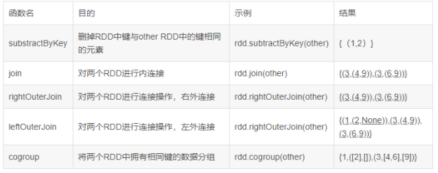
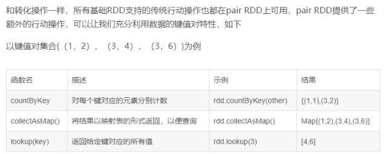

# Spark_PairRDD
## 什么是 Pair RDD

 Spark为包含键值对对类型的RDD提供了一些专有操作，这些操作就被称为Pair RDD。

## 操作 Pair RDD
### 创建 Pair RDD

创建 Pair RDD

```scala
scala> var lines = sc.parallelize(List("i love you"))
lines: org.apache.spark.rdd.RDD[String] = ParallelCollectionRDD[8] at parallelize at <console>:27

scala> val pairs = lines.map(x=>(x,1))
pairs: org.apache.spark.rdd.RDD[(String, Int)] = MapPartitionsRDD[9] at map at <console>:29

scala> pairs.foreach(println)
(i love you,1)
```

### Pair RDD 的 Transformation

- reduceByKey(func)

```scala
//合并具有相同key的value值
scala> val rdd = sc.parallelize(List((1,2),(3,4),(3,6)))
rdd: org.apache.spark.rdd.RDD[(Int, Int)] = ParallelCollectionRDD[12] at parallelize at <console>:27

scala> val result = rdd.reduceByKey((x,y)=>x+y)
result: org.apache.spark.rdd.RDD[(Int, Int)] = ShuffledRDD[14] at reduceByKey at <console>:29

scala> result.foreach(println)
(1,2)
(3,10)
```

- groupByKey()

```scala
//对具有相同键的进行分组 [数据分组]
scala> val result = rdd.groupByKey()
result: org.apache.spark.rdd.RDD[(Int, Iterable[Int])] = ShuffledRDD[1] at groupByKey at <console>:29

scala> result.foreach(println)
(3,CompactBuffer(4, 6))
(1,CompactBuffer(2))
```

- mapValues(func)

```scala
//对pairRDD中的每个值应用func 键不改变
scala> val result = rdd.mapValues(x=>x+1)
result: org.apache.spark.rdd.RDD[(Int, Int)] = MapPartitionsRDD[2] at mapValues at <console>:29

scala> result.foreach(println)
(1,3)
(3,5)
(3,7)
```

- flatMapValues(func)

```scala
//类似于mapValues，返回的是迭代器函数
scala> val result = rdd.flatMapValues(x=>(x to 5))
result: org.apache.spark.rdd.RDD[(Int, Int)] = MapPartitionsRDD[3] at flatMapValues at <console>:29

scala> result.foreach(println)
(3,4)
(3,5)
(1,2)
(1,3)
(1,4)
(1,5)
```

- keys

```scala
//返回一个仅包含键的RDD
scala> val result = rdd.keys
result: org.apache.spark.rdd.RDD[Int] = MapPartitionsRDD[4] at keys at <console>:29

scala> result.foreach(println)
3
1
3
```

- values

```scala
//返回一个仅包含value的RDD
scala> val result = rdd.values
result: org.apache.spark.rdd.RDD[Int] = MapPartitionsRDD[6] at values at <console>:29

scala> result.foreach(println)
2
4
6
```

- sortByKey()

```scala
//返回一个根据键排序的RDD (数据排序，可以通过接受ascending的参数表示我们是否想要结果按升序排序（默认是true）)
scala> val result = rdd.sortByKey().collect()
result: Array[(Int, Int)] = Array((1,2), (3,4), (3,6))

scala> result
res8: Array[(Int, Int)] = Array((1,2), (3,4), (3,6))

<pre name="code" class="java">scala> val result = rdd.sortByKey(ascending=false).collect()
result: Array[(Int, Int)] = Array((3,4), (3,6), (1,2))
```

#### 两个Pair RDD 的 Transformation



- subtractByKey( other )

```scala
//删除掉RDD中与other RDD中键相同的元素
scala> val rdd = sc.parallelize(List((1,2),(3,4),(3,6)))
rdd: org.apache.spark.rdd.RDD[(Int, Int)] = ParallelCollectionRDD[4] at parallelize at <console>:27

scala> val other = sc.parallelize(List((3,9)))
other: org.apache.spark.rdd.RDD[(Int, Int)] = ParallelCollectionRDD[5] at parallelize at <console>:27

scala> val result = rdd.subtractByKey(other)
result: org.apache.spark.rdd.RDD[(Int, Int)] = SubtractedRDD[6] at subtractByKey at <console>:31
scala> result.foreach(println)
(1,2)
```

- join( other )

```scala
//对两个RDD进行内连接
scala> val result = rdd.join(other)
result: org.apache.spark.rdd.RDD[(Int, (Int, Int))] = MapPartitionsRDD[12] at join at <console>:31

scala> result.foreach(println)
(3,(4,9))
(3,(6,9))
```

- rightOuterJoin(other)

```scala
//对两个RDD进行连接操作，确保第二个RDD的键必须存在（右外连接）
scala> val result = rdd.rightOuterJoin(other)
result: org.apache.spark.rdd.RDD[(Int, (Option[Int], Int))] = MapPartitionsRDD[15] at rightOuterJoin at <console>:31

scala> result.foreach(println)
(3,(Some(4),9))
(3,(Some(6),9))
```

- leftOuterJoin(other)

```scala
//对两个RDD进行连接操作，确保第一个RDD的键必须存在（左外连接）
scala> val result = rdd.leftOuterJoin(other)
result: org.apache.spark.rdd.RDD[(Int, (Int, Option[Int]))] = MapPartitionsRDD[18] at leftOuterJoin at <console>:31

scala> result.foreach(println)
(3,(4,Some(9)))
(3,(6,Some(9)))
(1,(2,None))
```

- cogroup(other)

```scala
//将有两个rdd中拥有相同键的数据分组
scala> val result = rdd.cogroup(other)
result: org.apache.spark.rdd.RDD[(Int, (Iterable[Int], Iterable[Int]))] = MapPartitionsRDD[20] at cogroup at <console>:31

scala> result.foreach(println)
(1,(CompactBuffer(2),CompactBuffer()))
(3,(CompactBuffer(4, 6),CompactBuffer(9)))
```

#### 过滤操作

```scala
//这里假设rdd={(1,2),(3,4),(3,6)}
//对value做控制，key不加限制条件
scala> val result = rdd.filter{case(x,y)=>y%3==0}
result: org.apache.spark.rdd.RDD[(Int, Int)] = MapPartitionsRDD[22] at filter at <console>:29

scala> result.foreach(println)
(3,6)

scala> val result = rdd.filter{case(x,y)=>y<=4}
result: org.apache.spark.rdd.RDD[(Int, Int)] = MapPartitionsRDD[23] at filter at <console>:29

scala> result.foreach(println)
(1,2)
(3,4)
```

```scala
//对key做控制，value不控制
scala> val result = rdd.filter{case(x,y)=>x<3}
result: org.apache.spark.rdd.RDD[(Int, Int)] = MapPartitionsRDD[24] at filter at <console>:29

scala> result.foreach(println)
(1,2)
```

#### 聚合操作

```scala
//实现经典的分布式单词计数问题（使用flatMap() 来生成以单词为键，以数字1为值的pair RDD）
scala> val rdd = sc.parallelize(List("i am thinkgamer, i love cyan"))
rdd: org.apache.spark.rdd.RDD[String] = ParallelCollectionRDD[49] at parallelize at <console>:27

scala> val words = rdd.flatMap(line => line.split(" "))
words: org.apache.spark.rdd.RDD[String] = MapPartitionsRDD[50] at flatMap at <console>:29

scala> val result = words.map(x=>(x,1)).reduceByKey((x,y) => x+y)
result: org.apache.spark.rdd.RDD[(String, Int)] = ShuffledRDD[52] at reduceByKey at <console>:31

scala> result.foreach(println)
(cyan,1)
(love,1)
(thinkgamer,,1)
(am,1)
(i,2)
```

```scala
//实现经典的分布式单词计数问题（使用countByValue更快的实现单词计数）
scala> val rdd = sc.parallelize(List("i am thinkgamer, i love cyan"))
rdd: org.apache.spark.rdd.RDD[String] = ParallelCollectionRDD[0] at parallelize at <console>:27

scala> val result = rdd.flatMap(x=>x.split(" ")).countByValue()
result: scala.collection.Map[String,Long] = Map(am -> 1, thinkgamer, -> 1, i -> 2, love -> 1, cyan -> 1)

scala> result.foreach(println)
(am,1)
(thinkgamer,,1)
(i,2)
(love,1)
(cyan,1)
```

### Pair RDD 的 Action
