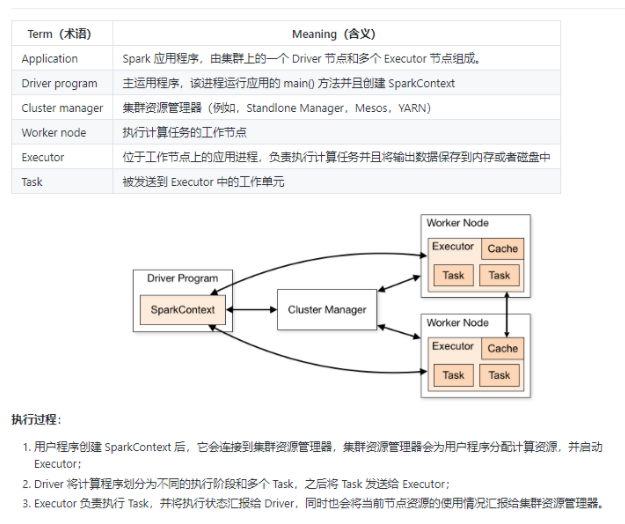
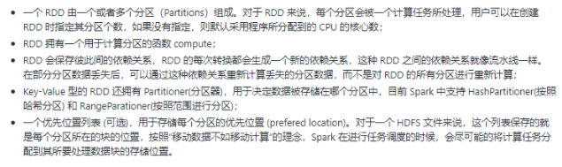
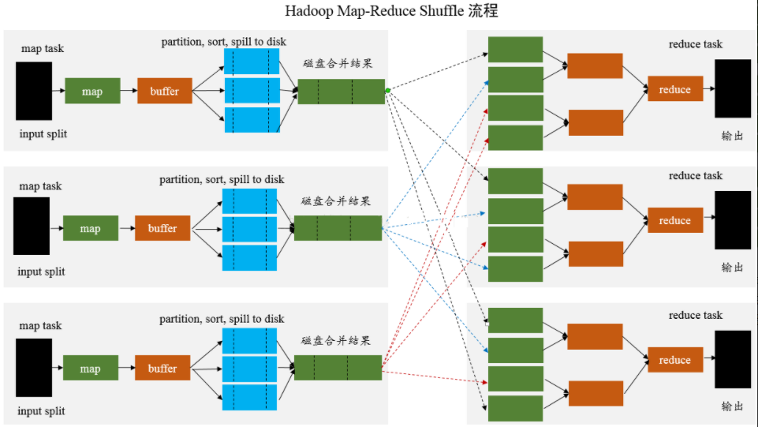
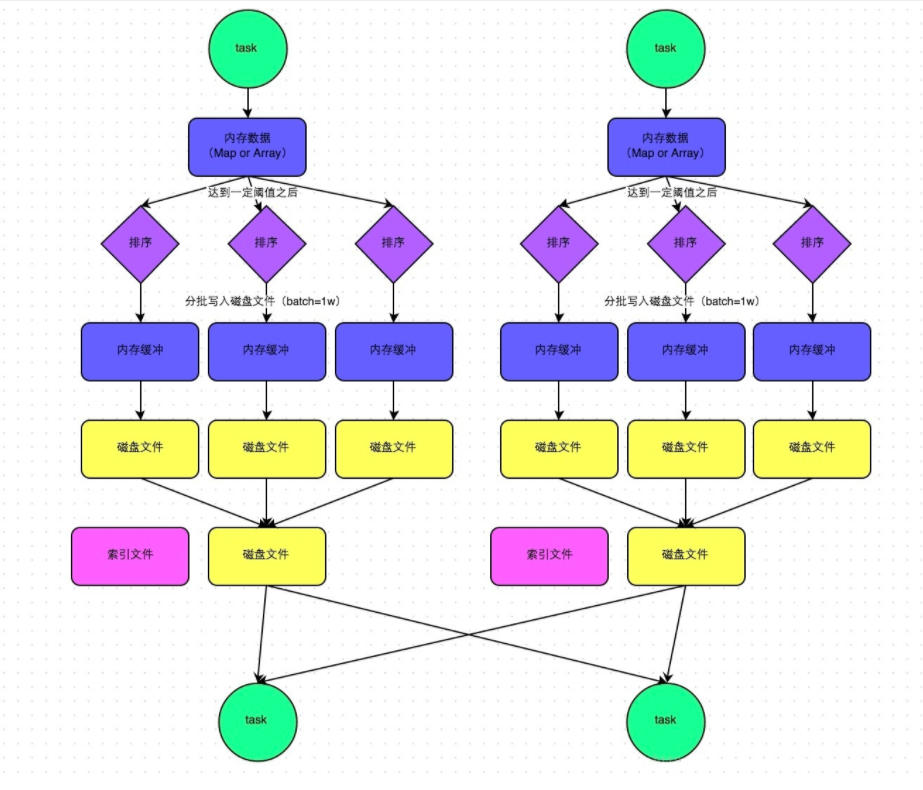
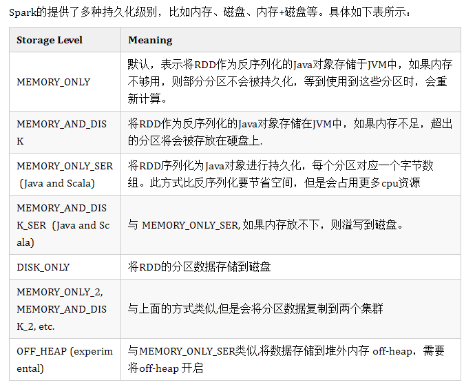
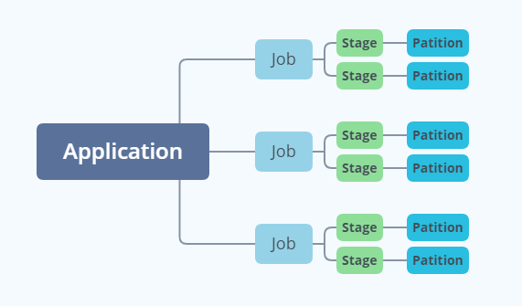

# Spark_总体

[参考资料地址：](https://github.com/heibaiying/BigData-Notes#三spark)

**如果会简单的 Scala 语言，那么学习 Spark 的时候会如虎添翼**

## Spark用来做什么？

取代MapReduce做批处理计算。

## 为什么 Spark 比 MapReduce 快？

- Spark 是基于内存的，而 MapReduce 是基于磁盘的。
- Spark 是基于线程方式运行在进程中的，MapReduce 是基于进程运行的。

## Spark集群架构。




## Spark的数据抽象。

spark的数据抽象是RDD，它是只读的、分区记录的集合，支持并行操作，可以由外部数据集或其他 RDD 转换而来，它具有以下特性：




## 创建RDD

1. 有现有集合创建
2. 引用外部数据集

**使用外部数据集需要注意：**

> 如果在集群环境下从本地文件系统读取数据，则要求该文件必须在集群中所有机器上都存在，且路径相同。
> 支持目录路径，支持压缩文件，支持使用通配符。

## 操作RDD

>RDD支持两种类型的操作：transformations（转换，从现有数据集创建新数据集）和 actions（在数据集上运行计算后将值返回到驱动程序）。RDD中的所有转换操作都是惰性的，它们只是记住这些转换操作，但不会立即执行，只有遇到 action 操作后才会真正的进行计算，这类似于函数式编程中的惰性求值。
- 理解Shuffle
  由于Shuffle操作对性能的影响比较大，所以需要特别注意使用，以下操作都会导致Shuffle：

>涉及到重新分区操作： 如repartition 和 coalesce；
>所有涉及到ByKey的操作：如groupByKey和reduceByKey，但countByKey除外；
>联结操作：如cogroup和join。

- 宽依赖和窄依赖
  RDD 和它的父 RDD(s) 之间的依赖关系分为两种不同的类型：

>窄依赖 (narrow dependency)：父 RDDs 的一个分区最多被子 RDDs 一个分区所依赖；
>宽依赖 (wide dependency)：父 RDDs 的一个分区可以被子 RDDs 的多个子分区所依赖。

- 区分这两种依赖是非常有用的：

>首先，窄依赖允许在一个集群节点上以流水线的方式（pipeline）对父分区数据进行计算，例如先执行 map 操作，然后执行 filter 操作。而宽依赖则需要计算好所有父分区的数据，然后再在节点之间进行 Shuffle，这与 MapReduce 类似。
>窄依赖能够更有效地进行数据恢复，因为只需重新对丢失分区的父分区进行计算，且不同节点之间可以并行计算；而对于宽依赖而言，如果数据丢失，则需要对所有父分区数据进行计算并再次 Shuffle。

###  外部数据集
Spark可以从Hadoop支持的任何存储源（包括本地文件系统，HDFS，Cassandra，HBase，Amazon S3等）创建分布式数据集。Spark支持文本文件，SequenceFiles和任何其他Hadoop InputFormat。

可以使用SparkContext的textFile方法创建文本文件RDD 。此方法需要一个URI的文件（本地路径的机器上，或一个hdfs://，s3a://等URI），并读取其作为行的集合。

- Java 代码

```java
public class Spark_Text_Demo {
    private static String appName = "spaer.text.demo";
    private static String master = "local[2]";
    public static void main(String[] args) {
        JavaSparkContext context = null;
        try {
            SparkConf conf = new SparkConf().setAppName(appName).setMaster(master);
            context = new JavaSparkContext(conf);

            JavaRDD<String> rdd = context.textFile("F:\\SparkText");
           // JavaRDD<String> rdd = context.textFile("hdfs://master01:9000/Demo_27");

            rdd.filter(new Function<String, Boolean>() {
                @Override
                public Boolean call(String s) throws Exception {
                    return s.contains("spark");
                }
            });

            Integer reduce = rdd.map(new Function<String, Integer>() {
                @Override
                public Integer call(String s) throws Exception {
                    return s.length();
                }
            }).reduce(new Function2<Integer, Integer, Integer>() {
                @Override
                public Integer call(Integer integer, Integer integer2) throws Exception {
                    return integer + integer2;
                }
            });

            System.out.println("执行结果：" + reduce);
        } catch (Exception e) {
            e.printStackTrace();
        }finally {
            if(context != null) {
                context.close();
            }
        }
    }
}
```
- Scala 代码

```scala
object WordCount {
  def main(args: Array[String]): Unit = {
    val conf = new SparkConf().setAppName("1208").setMaster("local[2]")
    val sc = new SparkContext(conf)
    sc.textFile("F:\\SparkText").flatMap(_.split(" ")).map((_,1)).reduceByKey(_+_).foreach(println)
    
    //sc.textFile("hdfs://master01:9000/Demo_27").flatMap(_.split(" ")).map((_,1)).reduceByKey(_+_).foreach(println)
  }
}
```
**注意事项**

- 如果在本地文件系统上使用路径，则还必须在工作节点上的相同路径上访问该文件。将文件复制给所有工作人员，或使用网络安装的共享文件系统。
- Spark的所有基于文件的输入法（包括textFile）都支持在目录，压缩文件和通配符上运行。例如，你可以使用textFile("/my/directory")，textFile("/my/directory/.txt")和textFile("/my/directory/.gz")。
- 该textFile方法还采用一个可选的第二个参数来控制文件的分区数。默认情况下，Spark为文件的每个块创建一个分区（HDFS中的块默认为128MB），但是您也可以通过传递更大的值来请求更大数量的分区。请注意，分区不能少于块。

### Stage 划分

Stage 的划分依据是：宽依赖。

Stage 与 Stage 之间的过程就是 Shuffle 。负责这个过程的是 ShuffleMapStage 和 ResultStage。

DAGScheduler 会将 Job 的 RDD 划分到不同的 Stage 中，并构建一个 Stage 的依赖关系，即DAG。这样划分的目的是既可以保障没有依赖关系的 Stage 可以并行执行，又可以保证存在依赖关系的 Stage 顺序执行。Stage 主要分为两种类型，一种是 ShuffleMapStage，另一种是 ResultStage。其中 ShuffleMapStage 是属于上游的 Stage，而 ResulStage 属于最下游的 Stage，这意味着上游的 Stage 先执行，最后执行 ResultStage。

可以这样理解：在 DAG 中进行反向解析，遇到宽依赖就断开、遇到窄依赖就把当前的 RDD 加入到当前的 Stage 中。即将窄依赖划分到同一个s Stage中，从而形成一个 Pipeline，提升计算效率。所以一个 DAG 图可以划分为多个 Stage，每个 Stage都代表了一组关联的，相互之间没有Shuffle依赖关系的任务组成的 Task 集合，每个 Task 集合会被提交到 TaskScheduler 进行调度处理，最终将任务分发到 Executor 中进行执行。

其实就是一句话：每一个独立的 Stage 中，只存在一种依赖，那就是窄依赖。

### Shuffle

Shuffle 可以理解为对数据的重组。

先看下 Hadoop 的 Shuffle 流程：



在 DAG 调度的过程中，Stage 阶段的划分是根据是否有 Shuffle 过程，也就是存在宽依赖的时候,需要进行 Shuffle,这时候会将 Job 划分成多个Stage，每一个 Stage 内部有很多可以并行运行的 Task。
Stage 与 Stage 之间的过程就是 Shuffle 阶段，在 Spark 中，负责 Shuffle 过程的执行、计算和处理的组件主要就是 ShuffleManager 。ShuffleManager 随着 Spark 的发展有两种实现的方式，分别为 HashShuffleManager 和 SortShuffleManager ，因此 Spark的Shuffle有 Hash Shuffle  和 Sort Shuffle 两种。

- HashShuffleManager

> HashShuffleManager 有着一个非常严重的弊端，就是会产生大量的中间磁盘文件，进而由大量的磁盘 IO 操作影响了性能。

- SortShuffleManager

> SortShuffleManager 相较于 HashShuffleManager 来说，主要就在于每个 Task 在进行 Shuffle 操作时，虽然也会产生较多的临时磁盘文件，但是最后会将所有的临时文件合并(Merge)成一个磁盘文件，因此每个 Task 就只有一个磁盘文件。在下一个 Stage 的 Shuffle Read Task 拉取自己的数据时，只要根据索引读取每个磁盘文件中的部分数据即可。

- SortShuffleManager 的运行机制

> 普通机制



>  运行流程

- 数据先写入数据结构，聚合算子写入 Map ，一边通过 Map 局部聚合，一边写入内存；Join 直接写入内存。
- 判断内存是否达到阈值（5M）。如果达到就将数据写入磁盘，清空内存。
- 数据在写入磁盘前会先排序，排序好的数据通过缓冲区溢写方式在分批写入磁盘文件。默认批次一万条。每次溢写都会产生一个磁盘文件。
- 在每个 Task 中，将所有临时文件合并。这个过程会将所有临时文件读取出来，一次写入到最终文件。这就意味着一个 Task 的所有数据都在这个文件中。同时单独写一份索引文件，标识下游各个 Task 的数据在文件中的  Start Offset 和 End Offset。

> 好处

1. 小文件明显变少了，一个 Task 只生成一个 File 文件。
2. File 文件整体有序，加上索引文件的辅助，查找变快，虽然排序浪费一些性能，但是查找变快很多。

### 广播变量

广播变量是一个只读的变量，并且在每个节点都保存一份副本，而不需要在集群中发送数据。

使用场景：当我们的数据有一部分在整个数据处理的流程中，是只读的时候，那么推荐使用广播变量。

- 代码

```scala
object SparkBroadcast {
  def main(args: Array[String]): Unit = {
    val conf = new SparkConf().setMaster("local[2]").setAppName("SparkBroadcast")
    val ssc = new SparkContext(conf)
    val mapData = Map("Spark" -> 10, "Flink" -> 20,"Hadoop" -> 15, "Hive" -> 9)
    //定义广播变量
    val broadRDD = ssc.broadcast(mapData)
    println(broadRDD.value)
    ssc.stop()
  }
}
```

**注意事项**

1. 不能将一个 RDD 使用广播变量广播出去。
2. 广播变量只能在 Driver 端定义，不能在 Executor 端定义。
3. 在 Driver 端可以修改广播变量的值，在 Executor 端无法修改广播变量的值。
4. 如果 Executor 端用到了 Driver 的变量，如果不使用广播变量在 Executor 有多少 Task 就有多少 Driver 端的变量副本。
5. 如果 Executor 端用到了 Driver 的变量，如果使用广播变量在每个 Executo r中只有一份Driver 端的变量副本

### 累加器

累加器是 Spark 提供的另外一个共享变量，与广播变量不同，累加器是可以被修改的，是可变的。

使用场景：调用 Foreach 访问 RDD 中的每个元素的时候，Foreach 内部不可更新其它变量，否则与预期结果不符。原因是： Spark 是以不同节点的一组任务并行一个函数，会把函数内的每个变量的副本发送到每个任务。

- 代码

```scala
object SparkAccumulator {
  def main(args: Array[String]): Unit = {
    val conf = new SparkConf().setMaster("local[2]").setAppName("SparkAccumulator")
    val ssc = new SparkContext(conf)
    val list = List(1, 2, 3, 4, 5, 6, 7, 8, 9, 10)
    val listRDD = ssc.parallelize(list)
    //定义外部变量
    var counter = 0
    //定义累加器
    val countAcc = ssc.longAccumulator("accumulator")
    val mapRDD = listRDD.map(num => {
      //外部变量的值并不会改变
      counter += 1
      //满足条件使用累加器
      if(num % 3 == 0) {
        countAcc.add(1)
      }
      num % 2
    })
    mapRDD.foreach(println)
    println("counter = " + counter)
    println("countAcc = " + countAcc)
    ssc.stop()
  }
}
```

> 我们在dirver中声明的一些局部变量或者成员变量，可以直接在transformation中使用，但是经过transformation操作之后，是不会将最终的结果重新赋值给dirver中的对应的变量。因为通过action触发transformation操作之后，transformation的操作都是通过DAGScheduler将代码打包，然后序列化，最后交由TaskScheduler传送到各个Worker节点中的Executor去执行，在transformation中执行的这些变量，是自己节点上的变量，不是dirver上最初的变量，只不过是将driver上的对应的变量拷贝了一份而已。

### 持久化

1. persist() 可以把数据缓存到内存和磁盘。
2. cache() 把数据缓存到内存中，本质上还是调用 persist() 方法。

- 持久化机制



### Spark 的任务调度

1. 初始化 Driver，Driver端运行客户端的main方法，构建SparkContext对象，在SparkContext对象内部依次构建DAGScheduler和TaskScheduler。
2. TaskScheduler 去注册中心 Master 注册，寻找 Work 启动 Executor 。
3. Executor 把注册的信息发送给 Driver 。
4. 按照 RDD 的操作，生成 DAG 有向无环图。
5. DAGScheduler 拿到 DAG 有向无环图之后，按照宽依赖进行 Stage 的划分。每一个 Stage 内部有很多可以并行运行的 Task，最后封装在一个一个的 TaskSet 集合中，然后把 TaskSet 发送给 TaskScheduler。
6. TaskScheduler 得到 TaskSet 集合之后，依次遍历取出每一个 Task 提交到 Worker 节点上的 Executor 进程中运行。
7. Task 运行完，任务结束。

**解释说明**

1. Application 在遇到不同的算子时会划分不同的 Job。
2. Job 会根据是否有宽依赖划分多个 Stage。
3. Stage 里又分多个 Task （任务逻辑相同，数据不同）。
4. 每个 Task 对应一个分区 Partition 。



### Spark 分区

1. HashPartitioner （Spark 默认）
2. RangePartitioner
3. 自定义分区

- 自定义分区代码

```scala
//自定义分区只要继承 Partitioner 类，重写其中的方法即可
class CustomerPartition(partitions: Int)  extends Partitioner{
  override def numPartitions: Int = partitions
  override def getPartition(key: Any): Int = {
    (key.toString.charAt(0) + scala.util.Random.nextInt(10)) % partitions
  }
}
```

```scala
object DefaultPartition {
  def main(args: Array[String]): Unit = {
    val spark = SparkSession.builder().master("local[2]").getOrCreate()
    val bigData = util.Arrays.asList("Hadoop", "Spark", "Flink", "Hive", "Impala", "Hbase", "Kafka", "ClickHouse", "KUDU", "zookeeper")
    import spark.implicits._
    val stringDataset = spark.createDataset(bigData)
    println("当前分区：" + stringDataset.rdd.partitions.length)

    val reparationDS = stringDataset.repartition(4)
    println("第一次分区：" + reparationDS.rdd.partitions.length)

    val stringRDD = stringDataset.rdd.map((word => (word,word.length)))
    val partitionRDD = stringRDD.partitionBy(new CustomerPartition(8))
    println("第二次分区：" + partitionRDD.partitions.length)
  }
}
```
- Spark 内自己的方法

1. coalesce() 方法，避免 Shuffle ，只能减少分区。
2. repartition() 方法，会有 Shuffle，可以减少分区和增加分区。


