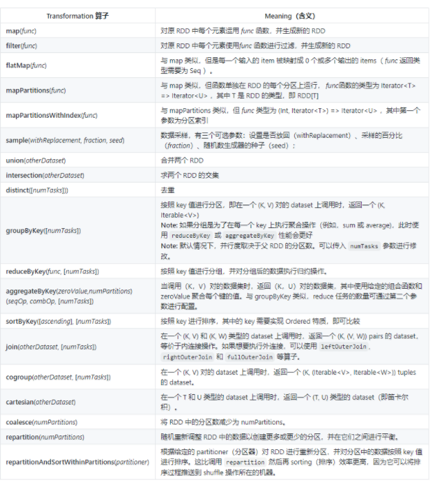
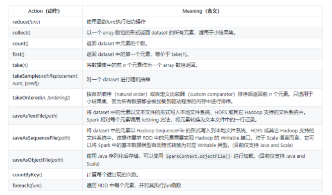

# Spark_算子
## Transformation


- map

对于输入的一行数据，会把这行数据解析成一个数组，然后需要单个数据再去数组中去取。

```scala
val list = List(1,2,3)
sc.parallelize(list).map(_ * 10).foreach(println)
// 输出结果： 10 20 30 （这里为了节省篇幅去掉了换行,后文亦同）
```

- filter

```scala
val list = List(3, 6, 9, 10, 12, 21)
sc.parallelize(list).filter(_ >= 10).foreach(println)
// 输出： 10 12 21
```

- flatMap

flatMap(func) 与 map 类似，但每一个输入的 item 会被映射成 0 个或多个输出的 items（ func 返回类型需要为 Seq）。

对于输入的一行数据，会把这行数据通过指定的规则解析成单个字符。（输入一行，输出多行）

```scala
val list = List(List(1, 2), List(3), List(), List(4, 5))
sc.parallelize(list).flatMap(_.toList).map(_ * 10).foreach(println)
// 输出结果 ： 10 20 30 40 50
```

flatMap 这个算子在日志分析中使用概率非常高，这里进行一下演示：拆分输入的每行数据为单个单词，并赋值为 1，代表出现一次，之后按照单词分组并统计其出现总次数，代码如下：

```scala
val lines = List("spark flume spark",
                 "hadoop flume hive")
sc.parallelize(lines).flatMap(line => line.split(" ")).
map(word=>(word,1)).reduceByKey(_+_).foreach(println)
// 输出：
(spark,2)
(hive,1)
(hadoop,1)
(flume,2)
```

- groupByKey 

```scala
//按照键进行分组：
val list = List(("hadoop", 2), ("spark", 3), ("spark", 5), ("storm", 6), ("hadoop", 2))
sc.parallelize(list).groupByKey().map(x => (x._1, x._2.toList)).foreach(println)
//输出：
(spark,List(3, 5))
(hadoop,List(2, 2))
(storm,List(6))
```

- reduceByKey

reduce处理数据时有着一对一的特性，而reduceByKey则有着多对一的特性。比如reduce中会把数据集合中每一个元素都处理一次，并且每一个元素都对应着一个输出。而reduceByKey则不同，它会把所有key相同的值处理并且进行归并，其中归并的方法可以自己定义

对元素为 [K , V] 的 RDD 中的 key 相同的元素的 value 进行 reduce 操作，key 相同的多个元素的值被 reduce 为一个值，然后与原 RDD 中的key 组成一个新的 [K , V] 对。
```scala
//按照键进行归约操作：
val list = List(("hadoop", 2), ("spark", 3), ("spark", 5), ("storm", 6), ("hadoop", 2))
sc.parallelize(list).reduceByKey(_ + _).foreach(println)
//输出
(spark,8)
(hadoop,4)
(storm,6)
```

- sortByKey

```scala
//按照键进行排序：
val list01 = List((100, "hadoop"), (90, "spark"), (120, "storm"))
sc.parallelize(list01).sortByKey(ascending = false).foreach(println)
// 输出
(120,storm)
(90,spark)
(100,hadoop)
```
- sortBy

```scala
按照指定元素进行排序：
val list02 = List(("hadoop",100), ("spark",90), ("storm",120))
sc.parallelize(list02).sortBy(x=>x._2,ascending=false).foreach(println)
// 输出
(storm,120)
(hadoop,100)
(spark,90)
```

- join

在一个 (K, V) 和 (K, W) 类型的 Dataset 上调用时，返回一个 (K, (V, W)) 的 Dataset，等价于内连接操作。如果想要执行外连接，可以使用 leftOuterJoin, rightOuterJoin 和 fullOuterJoin 等算子。

```scala
val list01 = List((1, "student01"), (2, "student02"), (3, "student03"))
val list02 = List((1, "teacher01"), (2, "teacher02"), (3, "teacher03"))
sc.parallelize(list01).join(sc.parallelize(list02)).foreach(println)
// 输出
(1,(student01,teacher01))
(3,(student03,teacher03))
(2,(student02,teacher02))
```

- intersection

两个RDD 交叉时，保留共有的数据元素

- subtract

找出两者不一致的内容（保留第一位的数据元素）

- union

不考虑其中重复的数据元素

- distinct

重复的元素删除，删除的过程不会把重复的元素删掉，而是重复的元素保留一份。

## Action


- reduce

```scala
//使用函数func执行归约操作：
val list = List(1, 2, 3, 4, 5)
sc.parallelize(list).reduce((x, y) => x + y)
sc.parallelize(list).reduce(_ + _)
```

- countByKey

```scala
//计算每个键出现的次数：
val list = List(("hadoop", 10), ("hadoop", 10), ("storm", 3), ("storm", 3), ("azkaban", 1))
sc.parallelize(list).countByKey()
// 输出： Map(hadoop -> 2, storm -> 2, azkaban -> 1)
```

- saveAsTextFile

将 dataset 中的元素以文本文件的形式写入本地文件系统、HDFS 或其它 Hadoop 支持的文件系统中。Spark 将对每个元素调用 toString 方法，将元素转换为文本文件中的一行记录。

```scala
val list = List(("hadoop", 10), ("hadoop", 10), ("storm", 3), ("storm", 3), ("azkaban", 1))
sc.parallelize(list).saveAsTextFile("/usr/file/temp")
```
