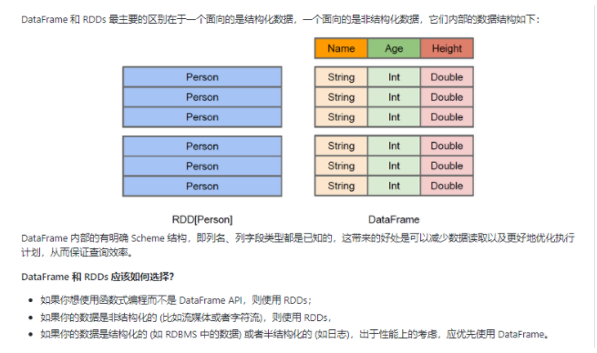
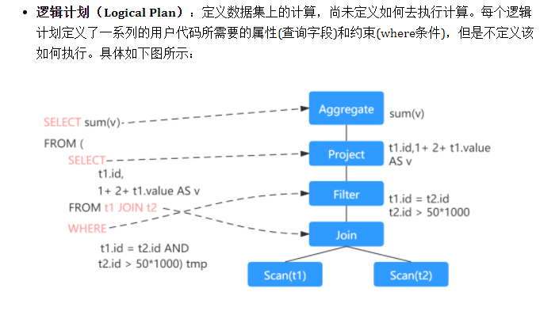
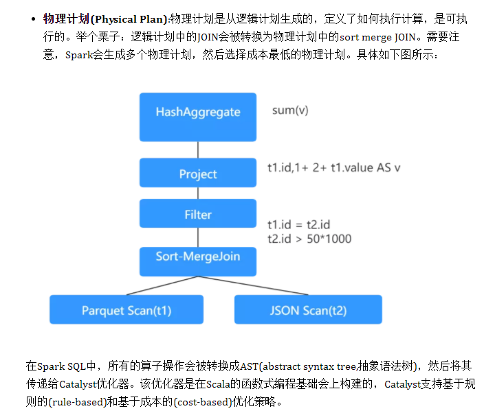

# SparkSQL_数据结构

## DataFrame

为了支持结构化数据的处理，Spark SQL 提供了新的数据结构 DataFrame。DataFrame 是一个由具名列组成的数据集。

### DataFrame & RDD

## DataSet

Dataset 也是分布式的数据集合，在 Spark 1.6 版本被引入，它集成了 RDD 和 DataFrame 的优点，具备强类型的特点，同时支持 Lambda 函数，但只能在 Scala 和 Java 语言中使用。在 Spark 2.0 后，为了方便开发者，Spark 将 DataFrame 和 Dataset 的 API 融合到一起，提供了结构化的 API(Structured API)，即用户可以通过一套标准的 API 就能完成对两者的操作。

### Dataset & DataFrame 的区别

1. 在 DataFrame 中，当你调用了 API 之外的函数，编译器就会报错，但如果你使用了一个不存在的字段名字，编译器依然无法发现。
2. Dataset 的 API 都是用 Lambda 函数和 JVM 类型对象表示的，所有不匹配的类型参数在编译时就会被发现。

## DataFrame & DataSet & RDD 总结

- RDDs 适合非结构化数据的处理，而 DataFrame & DataSet 更适合结构化数据和半结构化的处理。
- DataFrame & DataSet 可以通过统一的 Structured API 进行访问，而 RDDs 则更适合函数式编程的场景。
- 相比于 DataFrame 而言，DataSet 是强类型的 (Typed)，有着更为严格的静态类型检查。
- DataSets、DataFrames、SQL 的底层都依赖了 RDDs API，并对外提供结构化的访问接口。

## Spark SQL的运行原理

DataFrame、DataSet 和 Spark SQL 的实际执行流程都是相同的：

- 进行 DataFrame/Dataset/SQL 编程；
- 如果是有效的代码，即代码没有编译错误，Spark 会将其转换为一个逻辑计划；
- Spark 将此逻辑计划转换为物理计划，同时进行代码优化；
- Spark 然后在集群上执行这个物理计划 (基于 RDD 操作) 。

### 逻辑计划

### 物理计划

